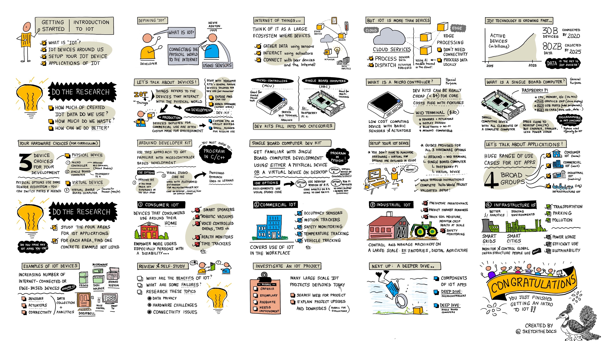
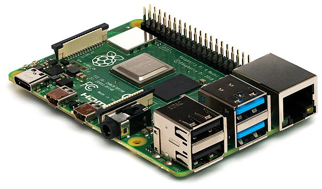

# 物联网（IoT）简介

> Sketchnote by [Nitya Narasimhan](https://github.com/nitya). 如果你想看比较大的图片，请点击它。

## 课前测验

[课前测验](https://brave-island-0b7c7f50f.azurestaticapps.net/quiz/1)

## 简介

本课程涵盖一些介绍物联网（IoT）的主题，以及教你怎么开始设置你的硬件。

本课程将涵盖：

* [什么是 ‘物联网（IoT）’？](#what-is-the-internet-of-things)
* [IoT 设备](#iot-devices)
* [设置你的设备](#set-up-your-device)
* [IoT 的应用场景](#applications-of-iot)
* [在你的周围的IoT 设备例子](#examples-of-iot-devices-you-may-have-around-you)

## 什么是 ‘物联网（IoT）’？

为了形容运用传感器（sensors，又译作感应器）来连接网络与物理世界，1999年 [凯文·阿什顿（Kevin Ashton）](https://wikipedia.org/wiki/Kevin_Ashton) 生造了‘物联网（IoT）’这个词。自从那时起，这个术语被用来形容任何能够与周围物理世界交互的设备。这些设备可以使用传感器收集数据，或者使用执行器(actuators，指的是执行诸如打开开关，点亮发光二极管等操作的设备）在物理世界完成任务。通常执行器会连接到其它设备或者互联网。

> **传感器** 从世界中收集数据，例如：测量速度、温度或地点。
>
> **执行器** 将电信号转换成现实世界的交互，例如：触发开关，打开灯，发出声音或将控制信号传送到其它硬件，例如，打开电源插座。

物联网作为一个技术领域，不仅是设备，它也包含云服务；这些服务能处理传感器数据，或者将请求传送给跟物联网设备有连接的执行器。它也包括没有或不需要互联网连接的设备；它们通常被称为“边缘设备（edge devices）”，而且它们有能力用基于云的AI模型自己处理与回应传感器的数据。

物联网是一个快速发展的技术领域。专家预计2020底，世界上有三百亿物联网设备部署并连接到互联网。专家也预计2025年，物联网设备将收集大概80 ZB（80万亿GB）的数据。这是巨量的数据！

✅ 做一点儿研究： 物联网设备收集的数据，多少是有用的、多少是被浪费的？为什么那么多数据被忽略了？

对于物联网的成功，这些数据是不可或缺的。想成为一名成功的物联网开发者，就必须了解你需要收集的数据、怎么收集它，怎么利用它来作出决策，以及如果有必要的话，怎么利用这些决策来和物理世界交互。

## 物联网设备

IoT 的 **T** 代表 **Things**（物）—— 可以和物理世界交互的设备；它们使用感应器收集数据或者使用执行器在物理世界完成任务。 

为生产或商业的设备（例：健身追踪器、工业机器控制器等）通常是定制的。它们使用定制电路板——甚至有可能是定制处理器——旨在满足特定任务的需求。例：要戴在手上的需要够小，或者要承受高温度、高压力、高振动的工厂环境的需要够耐用。

无论你正在学物联网或是在创建原型设备，作为一名 物联网开发者，你必须由一个开发者套件（developer kits）开始。这些是为物联网开发者设计的通用设备，通常具有生产设备上没有的功能，例如用来连接传感器或执行器的外部引脚、帮助排除错误的硬件，或者进行大规模生产时会增加不必要的成本的额外资源。

这些开发者套件通常有两种：微控制器（microcontrollers）和单板机（single-board computers）。我们会在这儿介绍它们，而将在下一课更详细地解释它们。

> 💁 你的手机也算是一个通用物联网设备；它拥有感应器与执行器，以及不同应用程序用不同的方式来和不同云服务利用它们。你甚至可以找到几个用手机的应用程序当作物联网设备的物联网教程。

### 微控制器

一个微控制器（MCU）是一个小型计算机。它包含：

🧠 至少一个中央处理器（CPU）；它就是微控制器的“大脑”——它用来运行你的程序

💾 内存（随机存取存储器（RAM）和程序存储器——储存你的程序、数据，和变量的地方

🔌 可编程输入/输出（I/O）连接——为了和外围设备（如传感器或执行器）通信

微控制器通常是较便宜的计算设备；定制硬件的平均成本下降到0.50美元，而有些设备低至 0.03 美元。开发者套件的起价低至 4 美元，但加上越多功能，价钱就越高。[Wio Terminal](https://www.seeedstudio.com/Wio-Terminal-p-4509.html) 是个来自 [Seeed studios](https://www.seeedstudio.com) 的微控制器；它包含传感器、执行器、Wi-Fi和一个屏幕，总共算起来大约 30美元。

> 💁 当你在网上寻找微控制器时，要小心用 **MCU** 这个词，因为这回带来许多关于漫威电影宇宙（Marvel Cinematic Universe）的搜索结果，而不是关于微控制器的。

微控制器被设计成通过编程完成有限数量的非常特定的任务，不像PC 或 Mac 那样的通用计算机。除了一些很特殊的场景，你无法连接显示器、键盘和鼠标并利用它完成通用任务。

微控制器开发者套件通常包括额外的传感器和执行器。大多数电路板会有至少一个可编程的发光二极管（LEDs），还有其它设备，例如用来添加不同制造商的传感器或执行器，或是用来添加内置传感器的标准插头（平时最常见的如温度）。有些微控制器有内置的无线连接如蓝牙或 Wi-Fi，或者在电路板上有额外的微控制器来添加这种连接。

> 💁 我们通常用 C 或 C++ 来为微控制器写程序。

### 单板机

单板机是一种小型计算设备；它把完整计算机的所有要素装在一个小板上。这些设备的规格与台式电脑或笔记本电脑比较相似，完整的操作系统，但体积小、耗电少，而且便宜得多。

Raspberry Pi 是其中最流行的单板机。

与微控制器一样，单板机具有CPU、内存和输入/输出引脚，但它们也有额外的功能，如一个让你连接显示器的图形芯片、音频输出，以及USB端口，它让你连接键盘、鼠标和其它标准USB设备如网络摄像头和外置储存。程序与操作系统一起存储在 SD 卡或硬盘驱动器上，而不是内置于板中的内存芯片。

> 🎓 你可以把单板机当成一个更小、更便宜的个人电脑，就像你现在正在用来读这篇文章的PC或Mac。可是，单板机还增加了通用输入/输出引脚（GPIO，general-purpose input/output），让你和传感器、执行器交互。

单板机是功能齐全的计算机，所以你可以用任何编程语言来为它写程序。我们通常用Python为物联网设备写程序。

### 日后课程的硬件选择

所有后续课程都包括使用物联网设备与物理世界交互，并与云通信的作业。每节课会支持3种设备选择：Arduino（使用Seeed Studios Wio Terminal）或者单板机，物理设备（Raspberry Pi 4），或在你的电脑上运行的虚拟单板机。 

你能在[硬件手册](../../../../hardware.md)查到完成作业所需的硬件。

> 💁 你不需要为了完成作业而买任何物联网硬件；虚拟单板机即可完成所有任务。

要使用哪种硬件是你的选择，取决于你家里或学校里有什么，以及你知道或想学的编程语言。两种硬件都使用同样的传感器生态系统，所以万一你想途中改变你的选择，你也不需要替换大部分的套件。用虚拟单板机相当于在Raspberry Pi上学习，如果你最后购买了设备和传感器，大部分代码都可以转移到 Pi 上。

### Arduino 开发者套件

如果你对微控制器的开发感兴趣，那你可以用一个 Arduino 设备完成作业。你需要对 C 或 C++ 的编程语言有基本的理解，因为将来的课程只会教关于 Arduino 框架的程序、需要用到的感应器和执行器以及跟云交互的库。

作业将用 [Visual Studio Code](https://code.visualstudio.com/?WT.mc_id=academic-17441-jabenn)  跟 [为微控制器开发的 PlatformIO 扩展](https://platformio.org). 如果你对 Arduino IDE 熟悉的话，你也能用它，但我们不会提供指示。

### 单板机开发者套件

如果你对使用单板机学物联网开发有兴趣，你可以用Raspberry Pi（树莓派），或者在你的电脑运行的虚拟设备来完成作业。

你需要对 Python 有基本的理解，因为将来的课程只会教授与所使用的传感器和执行器相关的代码，以及与云交互的库。

> 💁 如果你想学怎么用 Python 写程序，请查看下面的两个视频系列：
>
> * [Python for beginners（为初学者的 Python）](https://channel9.msdn.com/Series/Intro-to-Python-Development?WT.mc_id=academic-17441-jabenn)
> * [More Python for beginners（更多为初学者的 Python）](https://channel9.msdn.com/Series/More-Python-for-Beginners?WT.mc_id=academic-7372-jabenn)

作业将用 [Visual Studio Code](https://code.visualstudio.com/?WT.mc_id=academic-17441-jabenn)。

如果你使用的是Raspberry Pi，则可以使用完整桌面版 Raspberry Pi OS 运行你的树莓派，并使用 [VS Code 的 Raspberry Pi OS版](https://code.visualstudio.com/docs/setup/raspberry-pi?WT.mc_id=academic-17441-jabenn)直接在你的树莓派上写程序。或者把它当成一个无头设备，从你的电脑用 VS Code 的 [Remote SSH插件](https://code.visualstudio.com/docs/remote/ssh?WT.mc_id=academic-17441-jabenn)写程序；这个插件让你连接到树莓派，编辑，调试和运行代码，就像你直接在树莓派上写程序一样。

如果你选择用虚拟设备，将直接在你的电脑上写程序。你不会直接访问传感器和执行器，而是用工具来模拟此硬件，提供自己定义的传感器值，并在屏幕上显示执行器的结果。

## 设置你的设备

在你为你的物联网设备写程序前，你需要做点设置。请根据你将用到的设备，按照以下的指示进行操作。

> 💁 如果你还没有设备，请用
参阅[硬件手册](../../../../hardware.md) 帮你决定你要用的设备，以及你需要购买的额外硬件。当然硬件不是必需购买的，因为你可以用虚拟硬件运行所有的项目。

这些说明包括您将使用的硬件或工具的创建者提供的第三方网站链接。这是为了确保你始终遵照工具和硬件的最新说明。

按照相关的指南来设置你的设备，并完成一个“Hello World”项目。我们将用4个课程创造一个物联网夜灯，而这是第一步。

* [Arduino：Wio Terminal](wio-terminal.md)
* [单板机：Raspberry Pi](pi.md)
* [单板机：虚拟设备](virtual-device.md)

您将使用 VS Code在Arduino 和单板机上编程。如果您以前从未使用过它，请在 [VS Code 站点](https://code.visualstudio.com/?WT.mc_id=academic-17441-jabenn)上阅读更多相关信息。

## 物联网的应用场景

物联网涵盖了范围广泛的用例，涵盖了几个广泛的领域：

* 消费者物联网
* 商业物联网
* 工业物联网
* 基础设施物联网

✅ 做一点儿研究：对于以下描述的每个领域，找到一个文本中没有给出的具体例子。

### 消费物联网

消费物联网指的是消费者购买的家用物联网设备。这些设备中有的非常有用，例如：智能音箱、智能供暖系统和机器人吸尘器。其它的设备可用性则存疑，例如声控水龙头，这意味着您无法关闭它们，因为声控无法在流水声中听到您的声音。

消费物联网设备使人们能够在周围环境中获取更多能力，尤其是世界上的10亿个残障人士。机器人吸尘器能为行动不便、无法亲自清扫的人提供干净的地板、声控烤箱让视力或行动较差的人用自己的语音打开烤箱、健康监测器使患者能够监测自己的慢性病情况并定期得到更加详细的信息。这些设备将变得普及到连小孩子也在天天使用它们，如学生们在冠状病毒疫情时进行居家学习，利用智能家居设备的计时器记录他们的功课或者设置闹钟来提醒他们参与他们未来的课程。

✅ 你身上或家里有什么消费物联网设备呢？

### 商业物联网

商业物联网包含工作场所里的物联网用例。在办公室里，有可能会有空间占用传感器和移动探测器，这些物联网设备被用来管理灯光和供暖，在不需要的时候把它们关掉，以降低成本和碳排放。在工厂中，物联网设备可以监测安全隐患，例如：没有戴安全帽的人员或达到危险水平的噪音。在零售店，物联网设备可以测量冷库的温度，如果冰箱或冰柜超出所需的温度范围，将通知店主；或者它们可以监测货架上的商品，通知工作人员为卖完的产品补货。交通运输业也越来越依靠物联网设备来监测车辆位置、为道路使用者收费记录行驶里程、记录司机的工作时间和安全措施，或在车辆接近仓库准备装卸时通知工作人员。

✅ 你的学校或公司里有什么商业物联网设备呢？

### 工业物联网(IIoT)

工业物联网（也称为 “IIoT”）指的是使用物联网设备来大规模控制和管理机械。这包含很多用例，从工厂到数字农业。

工厂以多种不同方式使用物联网设备。它们能使用各种传感器（如：温度、振动、旋转速度等）来监测机械。我们可以监测这些数据，以便在机器超出特定指标时停止机器 （如它的温度太高）。我们也可以收集并分析这些数据，让人工智能（AI）模型学习故障前的数据，再利用它预报其它未来的故障；这就叫做“预测性维护”。

为了养活不断增长的人口，数字农业非常重要，尤其是对于依靠[自给农业](https://wikipedia.org/wiki/Subsistence_agriculture) 的5亿家户中的20亿人而言。数字农业的领域包括才几块钱的传感器，也包含大规模的商业装置。农民可以首先监测温度以及用[生长度日（GDD）](https://wikipedia.org/wiki/Growing_degree-day)，预测农作物什么时候收割。你们还可以将土壤湿度监测与自动浇水系统连接起来，为他们的植物提供刚好所需的水量，而不浪费水资源。最后，农民可以进一步、用无人驾驶飞机、卫星数据、人工智能来监测大面积农田的作物生长、疾病和土壤质量。

✅ 还有什么物联网设备可以用来帮助农民呢？

### 基础设施物联网

基础设施物联网正在监控和控制人们每天使用的本地和全球基础设施。

[智慧城市](https://wikipedia.org/wiki/Smart_city)是用物联网设备来收集关于城市的数据再利用这些数据来改善城市运行方式的城市地区。这些城市通常靠本地政府、学术界和本地企业之间的合作，监测和管理各种东西——从交通到停车和污染。一个例子是在哥本哈根（丹麦王国首都），空气污染对人民来说非常重要，所以对其进行测量，再用它给人民提供最干净的骑行与慢跑路线的信息。

[智能电网](https://wikipedia.org/wiki/Smart_grid)以收集各家各户使用电力的数据的方式来更好的分析电力需求。这些数据可以指导国家层面的决策，包括在哪里建新发电厂。以及让用户明确地了解自己使用了多少电力，何时使用，在个人层面上做出决策。还可以为我们提供减少浪费的建议，例如晚上为电动汽车充电。

✅ 假如你可以在你住的地方添加物联网设备，你会选择什么？

## 在你的周围的物联网设备例子

你会惊讶于你身边有多少物联网设备。我正在家里写这个课程的内容，有以下具有智能功能的设备连接到互联网，像是应用程式控制、语音控制、或者有能力通过手机把数据发给我的设备：

* 好几个智能音箱
* 冰箱、洗碗机、烤箱和微波炉
* 太阳能电池板的电量监测器
* 智能插座
* 可视门铃和安全摄像头
* 带有多个智能房间传感器的智能恒温器
* 车库开门器
* 家庭娱乐系统和声控电视
* 灯光
* 健身和健康追踪器

这些设备都有传感器和/或执行器与跟互联网沟通。我可以通过手机判断我的车库门是否打开，并让我的智能扬声器为我关闭它。我甚至可以为它设置一个计时器，如果车库门在晚上仍然打开，它会自动关闭。每当我的门铃响起，无论我在世界的哪儿个地方，我都能从手机看到门前是谁，并通过门铃的音箱和麦克风跟他们沟通。我能监测我的血糖、心率和睡眠周期，再用数据中的趋势来改善自己的健康状况。我能通过云控制我的灯，而当我的网络连接出状况，我能在黑暗中坐着。

---

## 🚀 挑战

尽可能多地列出家中、学校或工作场所中的物联网设备——有可能比你的想象中还要多！

## 课后测验

[课后测验](https://brave-island-0b7c7f50f.azurestaticapps.net/quiz/2)

## 复习和自学

阅读关于消费物联网项目的成功和失败。在新闻网站上找一找关于失败的文章，例如：隐私问题、硬件问题或者因缺少连接而发生的问题。

几个例子：

* 这个推特账户 **[Internet of Sh*t](https://twitter.com/internetofshit)** *(亵渎警告)* 有几个关于消费物联网失败的好例子。
* [c|net - 我的 Apple Watch 救了我一命：5个人分享他们的故事](https://www.cnet.com/news/apple-watch-lifesaving-health-features-read-5-peoples-stories/)
* [c|net - ADT 技术人员承认多年来一直监视客户的摄像头信息](https://www.cnet.com/news/adt-home-security-technician-pleads-guilty-to-spying-on-customer-camera-feeds-for-years/) *(触发警告：未经同意的偷窥)*

## 作业

[调查一个物联网（IoT）项目](../assignment.md)
