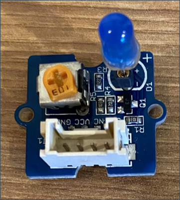

# Build a nightlight - Raspberry Pi

In this part of the lesson, you will add an LED to your Raspberry Pi and use it to create a nightlight.

## Hardware

The nightlight now needs an actuator.

The actuator is an **LED**, a [light-emitting diode](https://wikipedia.org/wiki/Light-emitting_diode) that emits light when current flows through it. This is a digital actuator that has 2 states, on and off. Sending a value of 1 turns the LED on, and 0 turns it off. The LED is an external Grove actuator and needs to be connected to the Grove Base hat on the Raspberry Pi.

The nightlight logic in pseudo-code is:

```output
Check the light level.
If the light is less than 300
    Turn the LED on
Otherwise
    Turn the LED off
```

### Connect the LED

The Grove LED comes as a module with a selection of LEDs, allowing you to choose the color.

#### Task - connect the LED

Connect the LED.



1. Pick your favourite LED and insert the legs into the two holes on the LED module.

    LEDs are light-emitting diodes, and diodes are electronic devices that can only carry current one way. This means the LED needs to be connected the right way round, otherwise it won't work.

    One of the legs of the LED is the positive pin, the other is the negative pin. The LED is not perfectly round and is slightly flatter on one side. The slightly flatter side is the negative pin. When you connect the LED to the module, make sure the pin by the rounded side is connected to the socket marked **+** on the outside of the module, and the flatter side is connected to the socket closer to the middle of the module.

1. The LED module has a spin button that allows you to control the brightness. Turn this all the way up to start with by rotating it anti-clockwise as far as it will go using a small Phillips head screwdriver.

1. Insert one end of a Grove cable into the socket on the LED module. It will only go in one way round.

1. With the Raspberry Pi powered off, connect the other end of the Grove cable to the digital socket marked **D5** on the Grove Base hat attached to the Pi. This socket is the second from the left, on the row of sockets next to the GPIO pins.


## Program the nightlight

The nightlight can now be programmed using the Grove sunlight sensor and the Grove LED.

### Task - program the nightlight

Program the nightlight.

1. Power up the Pi and wait for it to boot

1. Open the nightlight project in VS Code that you created in the previous part of this assignment, either running directly on the Pi or connected using the Remote SSH extension.

1. Add the following code to the `app.py` file to connect to import a required library. This should be added to the top, below the other `import` lines.

    ```python
    from grove.grove_led import GroveLed
    ```

    The `from grove.grove_led import GroveLed` statement imports the `GroveLed` from the Grove Python libraries. This library has code to interact with a Grove LED.

1. Add the following code after the `light_sensor` declaration to create an instance of the class that manages the LED:

    ```python
    led = GroveLed(5)
    ```

    The line `led = GroveLed(5)` creates an instance of the `GroveLed` class connecting to pin **D5** - the digital Grove pin that the LED is connected to.

    > 💁 All the sockets have unique pin numbers. Pins 0, 2, 4, and 6 are analog pins, pins 5, 16, 18, 22, 24, and 26 are digital pins.

1. Add a check inside the `while` loop, and before the `time.sleep` to check the light levels and turn the LED on or off:

    ```python
    if light < 300:
        led.on()
    else:
        led.off()
    ```

    This code checks the `light` value. If this is less than 300 it calls the `on` method of the `GroveLed` class which sends a digital value of 1 to the LED, turning it on. If the light value is greater than or equal to 300 it calls the `off` method, sending a digital value of 0 to the LED, turning it off.

    > 💁 This code should be indented to the same level as the `print('Light level:', light)` line to be inside the while loop!

    > 💁 When sending digital values to actuators, a 0 value is 0v, and a 1 value is the max voltage for the device. For the Raspberry Pi with Grove sensors and actuators, the 1 voltage is 3.3V.

1. From the VS Code Terminal, run the following to run your Python app:

    ```sh
    python3 app.py
    ```

    You should see light values being output to the console.

    ```output
    pi@raspberrypi:~/nightlight $ python3 app.py 
    Light level: 634
    Light level: 634
    Light level: 634
    Light level: 230
    Light level: 104
    Light level: 290
    ```

1. Cover and uncover the sunlight sensor. Notice how the LED will light up if the light level is 300 or less, and turn off when the light level is greater than 300.

    > 💁 If the LED doesn't turn on, make sure it is connected the right way round, and the spin button is set to full on.


> 💁 You can find this code in the [code-actuator/pi](code-actuator/pi) folder.

😀 Your nightlight program was a success!
