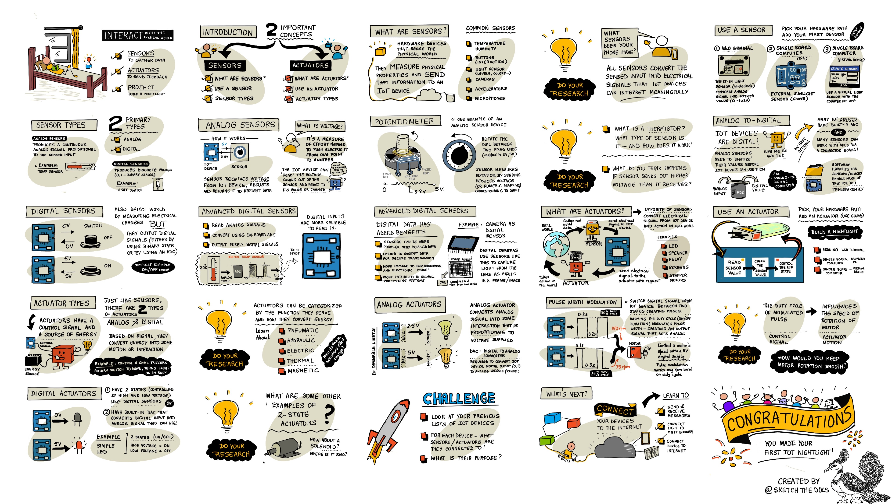

# 通过传感器和执行器与物理世界交互



> 由 [Nitya Narasimhan](https://github.com/nitya) 绘制。 单击图像可查看大图。

本课程是 [Hello IoT series](https://youtube.com/playlist?list=PLmsFUfdnGr3xRts0TIwyaHyQuHaNQcb6-) 。由 [Microsoft Reactor](https://developer.microsoft.com/reactor/?WT.mc_id=academic-17441-jabenn) 制作。 该课程以 2 个视频的形式授课 - 1小时的课程时间和1小时的答疑时间，使您能更深入地了解课程的各个部分并答疑解惑。

[](https://youtu.be/Lqalu1v6aF4)

[](https://youtu.be/qR3ekcMlLWA)

> 🎥 点击以上图片观看视频教程

## 课前小测试

[课前小测试](https://black-meadow-040d15503.1.azurestaticapps.net/quiz/5)

## 介绍

本节课程介绍了物联网设备的两个重要概念 - 传感器和执行器。你将亲自实践，为物联网项目添加一个光传感器，并通过获取光线亮度控制 LED 的开关，即制作一个夜灯。

在本课程中，我们将介绍：

* [传感器是什么？](#传感器是什么？)
* [怎样使用传感器](#怎样使用传感器)
* [传感器的类型](#传感器的类型)
* [执行器是什么？](#执行器是什么？)
* [怎样使用执行器](#怎样使用执行器)
* [执行器的类型](#执行器的类型)

## 传感器是什么？

传感器是感知物理世界的硬件设备 - 它们测量环境中的一个或多个属性并发送给物联网设备。鉴于物理世界可测量的东西很多，传感器也多种多样，从自然属性（如空气温度）到物理相互作用（如运动）。

一些常见的传感器包括：

* 温度传感器 - 这类传感器可感知空气温度或周围介质的温度。对于爱好者和开发人员来说，此类传感器通常集成气压和湿度的测量功能。
* 按钮 - 这些按键在按下时会反馈。
* 光传感器 - 这类传感器检测光的特性，可用于特定颜色、紫外线、红外光或一般可见光。
* 摄像头 - 这类传感器检通过拍摄照片或视频来感知世界的视觉表现。
* 加速度计 - 这类传感器可感测多个方向的运动。
* 麦克风 - 这类传感器可感知声音，无论是一般声级或定向声音。

✅ 做个研究。看看你的手机中有哪些传感器？

所有传感器都有一个共同点 - 它们将感知到的任何信息转换为可以被物联网设备解释的电信号。如何解释此电信号取决于传感器，以及与物联网设备通信的协议。

## 怎样使用传感器

按照以下指南将传感器添加到物联网设备：

* [Arduino - Wio 终端](wio-terminal-sensor.zh-cn.md)
* [单板计算机 - 树莓派](pi-sensor.zh-cn.md)
* [单板计算机 - 虚拟设备](virtual-device-sensor.zh-cn.md)

## 传感器的类型

传感器可以是模拟的，也可以是数字的。

### 模拟传感器

最基本的传感器是模拟传感器。这些传感器从物联网设备获取电压，传感器组件调整电压，并测量从传感器返回的电压给出传感器值。

> 🎓 电压是衡量将电流从一端移动到另一端的推力度量，例如从电池的正极到负极。例如，标准AA电池为1.5V（V是伏特的符号），即能够以1.5V的力将电流从其正极推到负极。不同的电气硬件需要不同的电压才能工作，例如，LED可以点亮2-3V，但100W灯丝灯泡需要240V。你可以在 [Voltage page on Wikipedia](https://wikipedia.org/wiki/Voltage) 上了解更多有关电压的信息。

比如电位计。是可以在两个位置间旋转的刻度盘，传感器会测量旋转角度。


物联网设备将以电压（例如 5V）向电位计发送电信号。当电位计调整时，它会改变从另一侧发出的电压。假设电位计标有从 0 到 [11](https://wikipedia.org/wiki/Up_to_eleven) 的刻度盘，如放大器上的音量旋钮。当电位计处于完全关闭位置 (0) 时，即输出 0V。当处于完全打开位置 (11) 时，即输出 5V。

> 🎓 这是个简单例子，你可以在 [potentiometer Wikipedia page](https://wikipedia.org/wiki/Potentiometer) 了解更多有关电位计和可变电阻器的信息。


之后，物联网设备读取来自传感器的电压，并对其响应。根据传感器的不同，该电压可以是任意值或映射到标准单位。例如，基于 [热敏电阻](https://wikipedia.org/wiki/Thermistor) 的温度传感器会根据温度改变其电阻。输出电压将被转换为温度单位开尔文(Kelvin)，也可使用°C或°F，这些都可通过程序实现。

✅ 如果传感器返回的电压高于发送的电压（如来自外部电源）会发生什么？ ⛔️ 不要测试这个。

#### 模数转换

物联网设备是数字的 - 其不能使用模拟值，只能使用 0 和 1。这意味着模拟传感器值需要先转换为数字信号后，才能进行处理。许多物联网设备具有模数转换器（ADC），用于将模拟输入转换为数字数值。传感器还可以通过连接器板与 ADC 配合使用。例如，在使用树莓派的Seeed Grove生态系统中，模拟传感器连接到Pi的“帽子”(扩展版)上的特定接口，“帽子”连接到Pi的GPIO引脚上，该“帽子”具有 ADC，可将电压转换为数字信号，并通过Pi的GPIO引脚发送。

假设你有一个光传感器连接到使用 3.3V 并返回 1V 的 IoT 设备。1V 在数字世界中毫无意义，因此需要转换。该电如何使用刻度转换为模拟值，取决于具体设备和传感器。比如 Seeed Grove 光传感器，它输出的值从 0 到 1，023。对于以 3.3V 运行的传感器，1V 即输出 300。物联网设备无法将 300 作为输入值处理，该值将被Grove “帽子” 转换为300的二进制表示`0000000100101100`。之后再由物联网设备处理。

✅ 如果你不了解二进制，请研究了解数字如何用 0 和 1 表示。[BBC Bitesize 二进制课程](https://www.bbc.co.uk/bitesize/guides/zwsbwmn/revision/1) 是一个很好的开始。

从编码的角度看，这通常由传感器附带的代码库实现，因此无需自己担心转换问题。Grove 光传感器可调用 Python 库的 `light` 属性，使用 Arduino 库可调用 `analogRead` 方法转换。

### 数字传感器

数字传感器，和模拟传感器类似，可利用电压的变化来检测周围的世界。不同之处在于它们输出数字信号，要么仅测量两种状态，要么使用内置ADC。数字传感器变得越来越普遍，以减少物联网设备对连接板或ADC的需求。

最简单的数字传感器是按钮或开关。一个具有两种状态（开或关）的传感器。


物联网设备上的引脚（如 GPIO）可直接将此信号测量为 0 或 1。如果发送的电压与返回的电压相同，则读取的值为 1，否则值为 0。其无需信号转换，只会是 1 或 0。

> 💁 电压测量不会精确，尤其是传感器组件中存在一些电阻，因此通常有误差。例如，树莓派的 GPIO 引脚在 3.3V 下工作，会将高于 1.8V 的返回信号读为 1，将低于 1.8V 的返回读为 0。

* 3.3V 输入按钮。按钮关闭，输出 0V，值为 0
* 3.3V 输入按钮。按钮打开，输出 3.3V，值为 1

更先进的数字传感器先读取模拟值，然后使用板载ADC将其转换为数字信号。例如，数字温度传感器使用与模拟传感器相同的热电偶方式，测量热电偶在当前温度下的电阻引起的电压变化。传感器内置的ADC不返回模拟值，也不依靠设备/连接器板转换为数字信号，而是直接将其转换为一系列 0 和 1 的编码发送给物联网设备。这些 0 和 1 的解析方式与数字信号相同，1 表示全电压，0 表示 0v。


发送数字信号数据让传感器变得更加复杂，同时也更详细，甚至在安全传感器上使用加密数据。比如摄像头，该传感器捕获图像并发送其数字化信息，信息通常采用标准压缩格式，如JPEG，以便于物联网设备读取。甚至可以通过逐帧发送捕获的图像或压缩的视频流来传输视频。

## 执行器是什么？

执行器与传感器相反 - 它们将来自物联网设备的电信号转换为与物理世界的交互，例如发出光或声音，或移动电机。

一些常见的执行器包括：

* LED - 打开时会发光
* 扬声器 - 根据接受到的信号发出声音，包括从基本的蜂鸣器到播放音乐的音频扬声器
* 步进电机 - 将信号转换为定义的旋转量，例如将拨盘旋转 90°
* 继电器 - 通过电信号打开或关闭的开关。可让物联网小电压设备打开较大的电压的设备。
* 屏幕 - 更复杂的执行器，可在多段显示器上显示信息。包括从简单的LED显示屏到高分辨率视频监视器。
  
✅ 做个研究。看看你的手机中有哪些执行器？

## 怎样使用执行器

按照下面的指南将执行器添加到物联网设备中，它们由传感器控制，共同制作物联网夜灯。夜灯将从光传感器接收光线亮度，在检测到的亮度较低时打开作为执行器的 LED。


* [Arduino - Wio 终端](wio-terminal-actuator.zh-cn.md)
* [单板计算机 - 树莓派](pi-actuator.zh-cn.md)
* [单板计算机 - 虚拟设备](virtual-device-actuator.zh-cn.md)

## 执行器的类型

与传感器一样，执行器也可是模拟或数字的。

### 模拟执行器

模拟执行器获取模拟信号并将其转换为某种交互操作，该操作根据提供的电压不同而变化。

例如家中可能有的调光灯。提供给灯的电压强度决定了它的亮度。


与传感器一样，物联网设备在数字信号上工作，而非模拟信号。这意味着要发送模拟信号，设备需要数模转换器（DAC），无论是自身具备或使用连接器板。这将来自物联网设备的 0 和 1 转换为执行器可以使用的模拟电压。

✅ 如果物联网设备发送高于执行器能承受的电压会发生什么？
⛔️ 不要测试这个。
 

#### 脉宽调制

将从设备获取的数字信号转换为模拟信号的另一种选择是脉宽调制。这需要发送大量短数字脉冲，就好像是模拟信号一样。

例如，可使用 PWM(脉宽调制) 来控制电机的速度。

假设你在使用一个 5V 的电机，你向电机发送短脉冲，将电压切换到高电平(5V)持续 0.02 秒。此时间内，电机可旋转十分之一，即 36°。接着信号暂停 0.02 秒后，发送低电平信号(0V)。每个开关周期持续 0.04 秒，并不断重复该循环。


这意味着在 1 秒钟内，有 25 次 5V 脉冲使电机每次旋转 0.02 秒，每个脉冲之后有 0.02 秒的 0V 暂停电机旋转。每次脉冲使电机旋转十分之一，电机每秒将完成 2.5 转。即使用数字信号以每秒 2.5 转或 [每分钟 150 转](https://wikipedia.org/wiki/Revolutions_per_minute) (旋转速度的非标准度量) 的速度旋转电机。

```output
每秒 25 次脉冲 x 每次脉冲 0.1 转 = 每秒 2.5 转
每秒 2.5 转 x 60 秒 = 150rpm (Revolutions Per Minute)
```

> 🎓 当 PWM 信号导通一半时间，关断一半时间时，称为[50%占空比](https://wikipedia.org/wiki/Duty_cycle)。占空比以信号处于导通与关断状态的时间百分比来衡量。


可以通过更改脉冲的大小来更改电机速度。例如，使用相同的电机，可保持相同的 0.04 秒循环时间，导通脉冲减半至 0.01 秒，关断脉冲增加到 0.03 秒。每秒具有相同数量的脉冲 (25)，但每个脉冲的长度只有之前的一半。半长脉冲仅使电机旋转二十分之一，每秒 25 个脉冲将完成每秒 1.25 转或 75rpm。即通过改变数字信号的脉冲速度，可将电机的速度减半。

```output
每秒 25 次脉冲 x 每次脉冲 0.05 转 = 每秒 1.25 转
每秒 1.25 转 x 60 秒 = 75rpm (Revolutions Per Minute)
```

✅ 如何保持电机平稳旋转，尤其是在低速运行时？你会使用少量具有长停顿的长脉冲，还是使用大量具有非常短停顿的短脉冲？

> 💁 一些传感器还使用PWM将模拟信号转换为数字信号。

> 🎓 可在 [pulse-width modulation page on Wikipedia](https://wikipedia.org/wiki/Pulse-width_modulation) 了解更多有关脉宽调制的信息。

### 数字执行器

数字执行器与数字传感器一样，具有由高电压或低压控制的两种状态，或内置DAC，因此可将数字信号转换为模拟信号。

例如 LED 就是简单的数字执行器。当设备发送数字信号 1 时，会发送高电压点亮 LED。当发送 0 时，电压降至 0V，LED 熄灭。


✅ 你还能想到哪些简单的具备2种状态的执行器？例如螺线管，它是一种电磁铁，可通电激活磁性来执行某些操作，如移动门栓来锁定/解锁门。

更先进的数字执行器，例如屏幕，需要以特定格式发送数字信息。通常利用代码库实现，以更方便准确地发送控制信息。

---

## 🚀 挑战

最后两节课的挑战是列出尽可能多的物联网设备，这些设备可能在你家，学校或工作场所中，确定它们使用微控制器还是单板计算机，或者是两者的混合。

对于列出的每个设备，它们连接到哪些传感器和执行器？连接到这些设备的每个传感器和执行器的用途是什么？

## 课后小测试

[课后小测试](https://black-meadow-040d15503.1.azurestaticapps.net/quiz/6)

## 复习与自学

* 在[ThingLearn](http://thinglearn.jenlooper.com/curriculum/) 上了解有关电力和电路的信息。
* 在 [Seeed Studios Temperature Sensors guide](https://www.seeedstudio.com/blog/2019/10/14/temperature-sensors-for-arduino-projects/) 中了解不同类型的温度传感器。
* 在 [Wikipedia LED page](https://wikipedia.org/wiki/Light-emitting_diode) 阅读有关 LED 的信息。

## 作业

[研究传感器和执行器](assignment.md)
