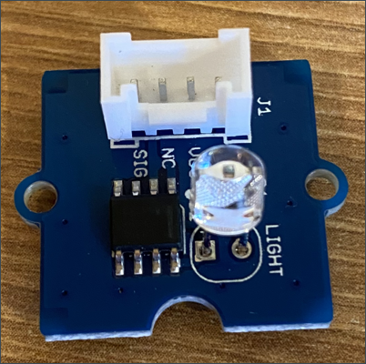
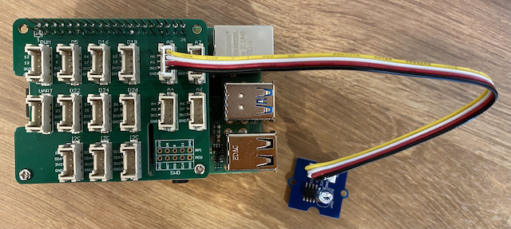

# 开发一个夜灯 - 树莓派

在这个部分的课程中，你会把一个光照传感器加到你的树莓派上。

## 硬件

这节课程的传感器是使用[光电二极管](https://wikipedia.org/wiki/Photodiode)来把光照转化为电子信号的光照传感器。这是一个发送从 0 到 1,000 整数值的模拟传感器，表示光照值的相对量而不对应任何比如[勒克斯（lux）](https://wikipedia.org/wiki/Lux)的标准计量单位。

这个光照传感器是一个外部 Grove 传感器，需要被连接到树莓派上的 Grove 基础扩展板。

### 连接光照传感器

用来检测光照等级的 Grove 光照传感器需要被连接到树莓派上。

#### 任务 - 连接光照传感器

连接光照传感器



1. 把 Grove 线缆的一端插到光照传感器模块的插孔中，这个只能从一个方向插入。

1. 在树莓派断电的情况下，把 Grove 线缆的另一端连接到树莓派上插着的 Grove 基础扩展板标着 **A0** 的模拟插孔。这个插孔在靠近 GPIO 引脚的一排，右数第二个。



## 编写光照传感器程序

现在设备可以用 Grove 光照传感器来编码了。

### 任务 - 编写光照传感器程序

编写设备程序。

1. 打开树莓派并等待启动完成。

1. 直接在树莓派上或者通过远程SSH扩展，打开你在这个作业上一部分创建的 VS Code 中的夜灯项目。

1. 打开 `app.py` 文件并删除里面的所有代码。

1. 把下面的代码加到 `app.py` 文件中来导入一些需要的函数库：

    ```python
    import time
    from grove.grove_light_sensor_v1_2 import GroveLightSensor
    ```

    `import time` 语句导入了 `time` 模块，在这个作业的后面会用到这个模块。

    `from grove.grove_light_sensor_v1_2 import GroveLightSensor` 语句从 Grove Python 函数库导入了 `GroveLightSensor`。这个函数库里有和 Grove 光照传感器交互的代码，在设置树莓派的时候就已经全局安装了。
    
1. 在上面代码的后面增加下面的代码来创建一个管理光照传感器的类的实例：

    ```python
    light_sensor = GroveLightSensor(0)
    ```

    `light_sensor = GroveLightSensor(0)` 这一行创建了一个连接到 **A0** 引脚的 `GroveLightSensor` 类的实例，**A0** 也就是光照传感器连接的那个引脚。
    
1. 在上面的代码后面增加一段无限循环代码，来获取光照传感器数值并打印到终端：

    ```python
    while True:
        light = light_sensor.light
        print('Light level:', light)
    ```

    使用`GroveLightSensor`类的 `light `属性可以来获取 0-1023 的当前光照等级值，这个属性从引脚读取模拟量，然后这个值会被打印到终端。
    
1. 在 `loop` 的结尾增加一个 1 秒的短暂休眠，因为光照等级不需要一直不断地读取。一个休眠可以减少设备的能源消耗。

    ```python
    time.sleep(1)
    ```
    
1. 从 VS Code 终端，运行下面的命令来运行你的 Python 应用：

    ```sh
    python3 app.py
    ```

    光照等级会在终端输出，遮挡和揭开光照传感器，输出的值也会相应变化：

    ```output
    pi@raspberrypi:~/nightlight $ python3 app.py 
    Light level: 634
    Light level: 634
    Light level: 634
    Light level: 230
    Light level: 104
    Light level: 290
    ```

> 💁 你可以在 [code-sensor/pi](../code-sensor/pi) 文件夹找到这份代码。

😀 给你的夜灯增加一个传感器程序就成功了！
