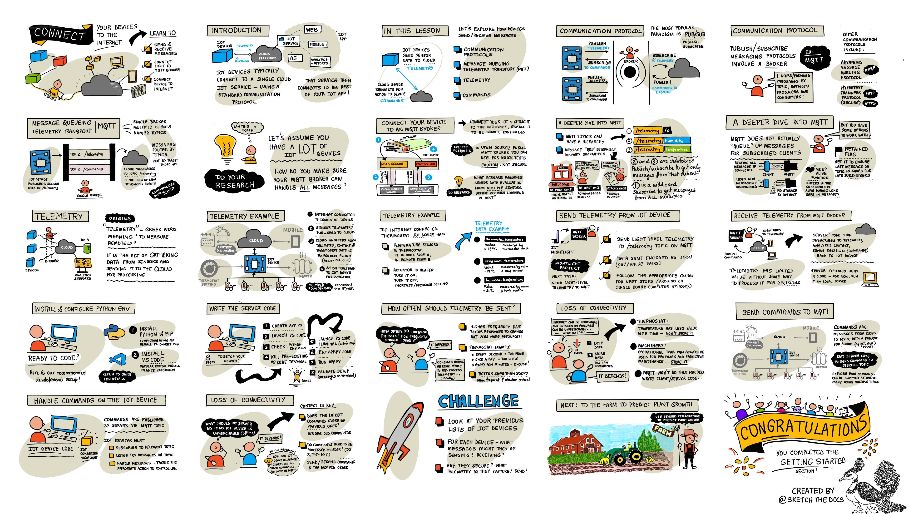
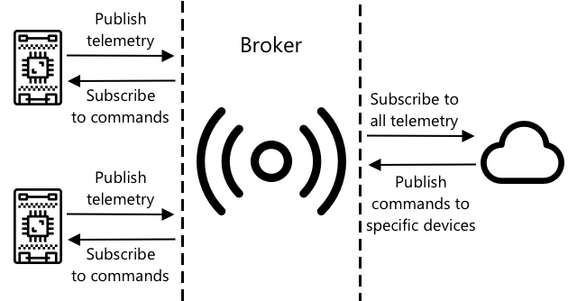

# 将你的设备连接到互联网



> 由 [Nitya Narasimhan](https://github.com/nitya) 创作。 单击图像可查看大图。

本课程是 [Hello IoT 系列](https://youtube.com/playlist?list=PLmsFUfdnGr3xRts0TIwyaHyQuHaNQcb6-) ，由 [Microsoft Reactor](https://developer.microsoft.com/reactor/?WT.mc_id=academic-17441-jabenn)制作。该课程以 2 个视频的形式授课 - 1小时的课程时间和1小时的答疑时间，使您能更深入地了解课程的各个部分并答疑解惑。

[](https://youtu.be/O4dd172mZhs)

[](https://youtu.be/j-cVCzRDE2Q)

> 🎥 点击以上图片观看视频教程

## 课前小测试

[课前小测试](https://black-meadow-040d15503.1.azurestaticapps.net/quiz/7)

## 介绍

物联网中的 **I** 代表互联网 - 可提供云连接和实现物联网设备的许多功能服务，比如从设备传感器收集测量值，或者发送指令以控制执行器。物联网设备通常使用标准通信协议连接到单个云 服务，再由该服务与设备的其他应用程序通信，比如通过数据做出智能判断的 AI 服务，或者用于控制或报告的 Web 应用程序。

> 🎓 从传感器收集数据并发送到云端称为遥测。

物联网设备可以从云端接收消息数据。通常数据中包含命令，该命令中可能是内部操作指令（例如重启或固件升级），或控制执行器（例如打开灯）执行某种操作。

本节课介绍了一些物联网设备可用于连接云端的通信协议，以及收发时使用的数据类型。你将亲自动手实践，把联网控制模块添加到夜灯中，即将本地的 LED 控制逻辑移动到云端。

在本课中，我们将介绍：

* [通信协议](#通信协议)
* [消息队列遥测传输(MQTT)](#消息队列遥测传输)
* [遥测](#遥测)
* [命令](#命令)

## 通信协议

物联网设备使用许多流行的通信协议与互联网进行通信。其中最受欢迎的是使用代理发布/订阅消息的协议。物联网设备连接到代理并发布遥测数据，同时订阅命令。云服务也连接到代理并订阅所有遥测消息，之后向特定设备或设备组发布命令。



本课程将介绍的 MQTT 协议是物联网设备最流行的通信协议，其他协议还包括 AMQP 和 HTTP / HTTPS。

## 消息队列遥测传输

[MQTT](http://mqtt.org) 是一种轻量级、开放的标准消息传递协议，可以在设备之间发送消息。它于1999年设计并用于监控石油管道，15年后由IBM作为开放标准发布。

MQTT 有一个代理和多个客户端。所有客户端都连接到代理，代理将消息选择发送到相关客户端。消息使用命名主题进行选择发送，而不是直接发送到单个客户端。客户端可以通过主题发布，所有订阅该主题的客户端都将收到该消息。


✅ 做一些研究。如果你有很多物联网设备，如何确保你的 MQTT 代理能够处理所有消息？

### 将物联网设备连接到 MQTT

将联网控制模块添加到夜灯的第一部分是将其连接到 MQTT 代理。

#### 任务

将设备连接到 MQTT 代理。

在本部分课程中，会将夜灯连接到互联网，以便对其进行远程控制。在后半部分，设备将通过 MQTT 协议发送消息到轻型公共 MQTT 代理，并需要编写一些服务端代码处理该消息。此代码会检查光线亮度水平，并将命令回传设备，控制其打开或关闭 LED。

这种设置可能的使用场景是在具有较多照明灯的环境中，需要通过多个光传感器收集的数据判断是否开灯，例如体育场。如果只有一个传感器被云或鸟覆盖，但其他传感器检测到足够的光线水平，将不会开灯。

✅ 还有哪些情况需要在发送命令之前评估来自多个传感器的数据？

为避免搭建复杂的 MQTT 代理，可以直接使用开源 MQTT 代理 [Eclipse Mosquitto](https://www.mosquitto.org) 的公共测试服务器。该测试代理在 [test.mosquitto.org](https://test.mosquitto.org) 上公开，且不需要设置帐户，是测试 MQTT 代码的绝佳工具。

> 💁 此测试代理是公共的，并不安全。任何人都可以接收到你发布的内容，因此不应用于保密数据的传递


按照以下步骤将设备连接到 MQTT 代理：

* [Arduino终端](../wio-terminal-mqtt.md)
* [单板计算机 - 树莓派/虚拟设备](../single-board-computer-mqtt.md)

### 深入了解 MQTT

主题可具有层次结构，客户端可以使用通配符订阅主题结构的不同层级。例如，可以向 `/telemetry/temperature` 发送温度消息，向 `/telemetry/humidity`  发送湿度消息，然后在云应用中订阅 `/telemetry/*` 以接收温度和湿度消息。

消息可以使用服务质量 （QoS） 发送，服务质量决定消息的可靠性。

* 最多一次 - 消息仅发送一次，客户端和代理不采取其他步骤来确认传递（触发并忘记）。
* 至少一次 - 发送方多次重发消息，直到收到确认（确认传递）。
* 恰好一次 - 发送方和接收方进行两级握手，以确保只收到消息的一个副本（保证传递）。

✅ 在哪些情况下可能需要通过触发并忘记的方式传递消息？

虽然名称是消息队列（MQTT 中的首字母缩写），但它实际上并不支持消息队列。这意味着，如果客户端断开连接，然后重新连接，则它不会收到断开连接期间发送的消息，除非是使用 QoS 进程处理的消息。但消息可以设置保留标志，如果设置此选项，MQTT 代理将存储在该主题上的最后一条消息，并将其发送给稍后订阅所有客户端。这样，客户端将始终获取最新消息。

MQTT 还支持保心跳包功能，该功能在消息的长间隔时间检查连接是否仍处于活动状态。

> 🦟 Eclipse 基金会的 [Mosquitto](https://mosquitto.org) 包含免费的 MQTT 代理，可自行搭建用于测试 MQTT，也可使用其搭建的公共 MQTT 代理，该代理托管在 [test.mosquitto.org](https://test.mosquitto.org)。

MQTT 连接可以是公开的，也可使用用户名和密码或证书加密保护。

> 💁 MQTT 通过 TCP/IP（与 HTTP 使用相同的底层网络协议）进行通信，但端口不同。也可使用 websocket 与浏览器 Web 应用，或防火墙等网络规则阻止标准 MQTT 连接的情况下进行通信。

## 遥测

遥测一词源自希腊词根，意思是远程测量。这里的遥测是指从传感器收集数据并将其发送到云端的行为。

> 💁 最早的遥测设备之一是1874年在法国发明的，它将实时天气和积雪厚度从勃朗峰发送到巴黎。当时使用的是物理电线，因为还没有无线技术。

让我们回顾一下第 1 课中的智能恒温器示例。


恒温器使用温度传感器来收集遥测数据。它可能内置了一个温度传感器，并通过[低功耗蓝牙](https://wikipedia.org/wiki/Bluetooth_Low_Energy)（BLE）等无线协议连接到多个外部温度传感器。

例如遥测数据可能如下：

| 名字 | 值 | 描述 |
| ---- | ----- | ----------- |
| `恒温器温度` | 18°C | 恒温器内置传感器测量的温度 |
| `起居室温度` | 19°C | 远程测量的起居室内传感器温度 |
| `卧室温度` | 21°C | 远程测量的卧室内传感器温度 |

然后，云服务可以使用此遥测数据来决定发送哪些命令来控制加热。

### 从物联网设备发送遥测数据

接下来将光线强度的遥测数据发送到相应主题的 MQTT 代理，以进一步完成夜灯网络控制模块的添加。

#### 任务 - 从物联网设备发送遥测数据

将光线遥测数据发送到 MQTT 代理。

数据以 JSON 编码方式发送 - JSON是JavaScript 对象表示法的缩写，一种使用键/值对文本数据进行编码的标准。

✅ 如果之前没了解过 JSON，可以在 [JSON.org 的文档](https://www.json.org/) 中了解更多信息。

按照以下步骤将遥测数据发送到 MQTT 代理：

* [Arduino终端](../wio-terminal-telemetry.md)
* [单板计算机 - 树莓派/虚拟设备](../single-board-computer-telemetry.md)

### 从 MQTT 代理接收遥测数据

如果在另一端没有服务监听，那么发送这些遥测数据毫无意义。光线强度的遥测数据需要在另一端监听和处理。此“服务器”代码可作为更大的物联网应用程序的一部分部署到云端，但这里将部署在本地计算机（如果使用树莓配开发也可直接部署在树莓派上）。服务器代码由使用 python 应用程序通过 MQTT 监听包含光线强度信息的遥测数据。在后半部分课程中将展示如何回复消息，该消息中包含打开或关闭 LED 的指令。

✅ 做一些研究：如果没有服务监听，MQTT 消息会被如何处理？

#### 安装 Python 和 VScode

如果未在本地安装 Python 和 VS Code，则需同时安装以对服务器编程。如果使用的是虚拟物联网设备，或是树莓派，说明安装和配置已完成，可跳过此步骤。

##### 任务 - 安装 Python 和 VScode

安装 Python 和 VS Code。

1. 安装 Python。有关安装最新版本的 Python 的说明，请参阅 [Python 下载页](https://www.python.org/downloads/)。

2. 安装 Visual Studio Code （VS Code）。用于在虚拟设备中编写Python代码的编辑器。有关安装 VS Code 的说明，请参阅 [VS Code 文档](https://code.visualstudio.com?WT.mc_id=academic-17441-jabenn)。

    > 💁 你可以使用任何 Python IDE 或习惯的编辑器，但此课程将基于 VS Code 提供说明。

3. 安装 VS Code Pylance 扩展。这是提供 Python 语言支持的 VS Code 的扩展。有关在 VS Code 中安装此扩展的说明，请参阅 [Pylance 扩展文档](https://marketplace.visualstudio.com/items?WT.mc_id=academic-17441-jabenn&itemName=ms-python.vscode-pylance)。

#### 配置 Python 虚拟环境

Python 的强大功能之一是能够安装 [pip 包](https://pypi.org) - 这是由第三方编写并发布到的代码包。可使用 pip 命令安装后使用。接下来将使用 pip 安装 MQTT 通信模块。

默认情况下，当安装软件包时，在本机任意环境下都可使用，这可能导致版本兼容问题 - 比如一个应用依赖于软件包的某个版本，当为另一个应用安装新版本时就会报错。可以用 Python 虚拟环境解决此问题，本质上是 Python 的指定文件夹副本，当安装 pip 包时，只会安装到指定文件夹中。

##### 任务 - 配置 Python 虚拟环境

配置 Python 虚拟环境并通过 pip 安装 MQTT 模块。

1. 从终端或命令行中，运行以下命令以创建并进入到新目录：

    ```sh
    mkdir nightlight-server
    cd nightlight-server
    ```

2. 在 `.venv` 文件夹中运行以下命令以创建虚拟环境：

    ```sh
    python3 -m venv .venv
    ```

    > 💁 需要指定使用 `python3` 创建虚拟环境，以防可能安装的 Python 2 对 Python 3 （最新版本）的影响。如果安装了 Python2，那么调用 `python` 命令时可能将使用的时 Python 2 而非 Python 3。

3. 激活虚拟环境:

    * 在 Windows 上:
        * If you are using the Command Prompt, or the Command Prompt through Windows Terminal, run:

            ```cmd
            .venv\Scripts\activate.bat
            ```

        * If you are using PowerShell, run:

            ```powershell
            .\.venv\Scripts\Activate.ps1
            ```

    * 在 macOS 或 Linux 上, 执行:

        ```cmd
        source ./.venv/bin/activate
        ```

    > 💁这些命令应在创建虚拟环境时的同一位置运行。无需手动进入 `.venv` 文件夹，在安装 pip 包时只需提前使用 activate 命令进入之前创建的虚拟环境。

4. 激活虚拟环境后，`python` 命令将使用创建环境时使用的版本运行，可通过以下命令以查询 `python` 版本：

    ```sh
    python --version
    ```

    将输出类似以下内容：

    ```output
    (.venv) ➜  nightlight-server python --version
    Python 3.9.1
    ```

    > 💁 你的 Python 版本可能与上述不同 - 建议使用高于 3.6 的版本，如若不是，可重装更换。

5. 运行以下命令，安装 [Paho-MQTT](https://pypi.org/project/paho-mqtt/)（一个流行的 MQTT 库） 的 pip 包。

    ```sh
    pip install paho-mqtt
    ```

    此 pip 包将仅安装在虚拟环境中，此环境之外无法使用。

#### 编写服务端代码

服务端代码也可使用 python 语言编写。

##### 任务 - 编写服务端代码

编写服务端代码。

1. 在虚拟环境终端中运行以下命令以创建一个名为 `app.py` 的 Python 文件：

    * Windows 上运行:

        ```cmd
        type nul > app.py
        ```

    * 在 macOS 或 Linux 上运行:

        ```cmd
        touch app.py
        ```

2. 在 VS Code 中打开当前目录:

    ```sh
    code .
    ```

3. 当VS Code启动时，它将激活Python虚拟环境。在底部状态栏中会显示通知：

    

4. 如果 VS Code 启动时 VS 代码终端已在运行，则不会激活虚拟环境。最简单的方法是使用 **终止活动终端实例** 按钮关闭终端：

    

5. 通过选择终端 -> 新建终端或按 `` CTRL+` `` 来启动新终端。新终端将加载虚拟环境，激活调用会在终端显示。虚拟环境名 (`.venv`) 也将出现在提示符中：

    ```output
    ➜  nightlight-server source .venv/bin/activate
    (.venv) ➜  nightlight 
    ```

6. 使用 VS Code 打开 `app.py` 并添加以下代码：

    ```python
    import json
    import time
    
    import paho.mqtt.client as mqtt
    
    id = '<ID>'
    
    client_telemetry_topic = id + '/telemetry'
    client_name = id + 'nightlight_server'
    
    mqtt_client = mqtt.Client(client_name)
    mqtt_client.connect('test.mosquitto.org')
    
    mqtt_client.loop_start()
    
    def handle_telemetry(client, userdata, message):
        payload = json.loads(message.payload.decode())
        print("Message received:", payload)
    
    mqtt_client.subscribe(client_telemetry_topic)
    mqtt_client.on_message = handle_telemetry
    
    while True:
        time.sleep(2)
    ```

    将第 6 行的 `<ID>` 替换为创建设备时使用的唯一 ID。

    ⚠️ 此 ID  **必须** 与设备上使用的 ID 相同，否则服务器将无法订阅或发布到正确的主题。

    此代码创建具有唯一名称的 MQTT 客户端，并连接到 test.mosquitto.org 代理服务器。然后启动一个处理循环，该循环将在后台监听相关主题所有的订阅消息。

    客户端将订阅该遥测主题上的消息，并定义在收到消息时调用的函数。当收到遥测消息时，会调用该函数，并打印到控制台上。

    最后，无限循环确保应用程序持续运行。MQTT 客户端在后台监听消息，并和主应用程序同时保持运行。

7. 在 VS Code 终端中，运行以下命令以打开 Python 应用：

    ```sh
    python app.py
    ```

    该应用程序将开始监听来自设备的消息。

8. 确保设备始终在运行并发送遥测消息。调整环境光线或虚拟设置来改变光照水平。收到的消息将打印在终端上。

    ```output
    (.venv) ➜  nightlight-server python app.py
    Message received: {'light': 0}
    Message received: {'light': 400}
    ```

    nightlight 虚拟环境中的 app.py 必须与 nightlight-server 虚拟环境相对应，才能接收正在发送的消息。

> 💁 可在[code-server/server](../code-server/server)文件夹中查阅此代码。

### 遥测应多久发送一次?

遥测中的一个重要事项是测量和发送数据的频率，这视情况而定。测量频率高将更快的获取测量值的变化，但也更耗电，并占用更多带宽，产生更多数据，需要更多的云端资源。所以需要足够的测量频率，但不能过于频繁。

对于恒温器，每隔几分钟测量一次可能绰绰有余，因为温度不会经常变化。如果每天只测量一次，则可能会在阳光明媚的中午却为房子供暖，如果你每秒测量一次，将产生诸多不必要的重复测量，这将延迟速度和消耗带宽（对于带宽有限的人是个问题），且更加耗电，这对于通过电池供电的远程传感器类设备来说是个问题，还将增加云计算资源处理和存储的成本。

对于监控工厂中机器环境数据的情况而言，如果机器发生故障，可能会造成灾难性的损坏和数百万美元的损失，那么可能需要每秒多次测量。浪费带宽总比错过遥测数据要好，这样可在机器在坏掉之前及时获取故障数据以停止和修理。

> 💁 在这种情况下，可以考虑先使用边缘设备来处理遥测数据，以减少对网络的依赖。

### 连接中断

互联网连接并不可靠，中断很常见。在此情况下，物联网设备应该丢弃数据，还是存储数据直到连接恢复？同样，答案也是视情况而定。

对恒温器而言，一旦进行新的测量，旧数据将会丢失。供暖系统并不关心 20 分钟前测量的 20.5°C，只依据现有测量的 19°C 来决定打开或关闭暖气。

而对一些希望保留数据的设备，尤其是想查询历史数据趋势的。一些机器学习模型可通过查看某段时间（例如过去一小时）的数据并检测数据流中的异常。这通常用于预测性维护，即寻找可能存在异常迹象，以在损坏之前及时修复或更换。这时就需要发送所有的遥测数据，以便更准确地进行异常检测，因此，一旦设备恢复联网，将发送在网络中断期间生成的数据。

物联网设备设计人员还应考虑设备是否能在网络中断或由位置引起的信号丢失期间正常使用。如果智能恒温器由于网络中断而无法将数据发送到云端，则自身应该能够做出一些有限的决定来控制加热。

[](https://twitter.com/internetofshit/status/1315736960082808832)

为了使 MQTT 能处理断网时消息，设备和服务器的代码需实现在按需可靠传输，比如要求所有发送的消息必须有回复确认，如果未收到确认信息就将原消息延时重传(类似TCP)。

## 命令

命令是云端发送到设备，用于指示其执行操作的消息。多数情况下会控制执行器提供某种输出，但也可以是控制设备本身的指令，例如重启或收集额外的遥测数据并回传。


恒温器可以从云端接收命令以打开暖气。根据所有传感器的遥测数据，云服务将加以判断，并在需要时发送相关命令打开暖气。

### 向 MQTT 代理发送命令

下一步将编写服务器代码将命令发送回物联网设备，以根据它感知的光线水平控制灯光。

1. 在 VS code 中打开服务器代码：

2. 在 `client_telemetry_topic` 的声明后添加以下行，以确定命令发送的主题：

    ```python
    server_command_topic = id + '/commands'
    ```

3. 在 `handle_telemetry` 函数后添加以下代码：

    ```python
    command = { 'led_on' : payload['light'] < 300 }
    print("Sending message:", command)
    
    client.publish(server_command_topic, json.dumps(command))
    ```

    这会向命令主题发送一条 JSON 消息，包含 `led_on` 的值设置为 true 或 false，具体取决于光线水平是否小于 300。如果光线水平小于 300，则发送 true 以控制设备打开 LED。

4. 用常规方式运行代码

5. 调整环境光线或虚拟设置来改变光照水平。收到的消息将打印在终端上：

    ```output
    (.venv) ➜  nightlight-server python app.py
    Message received: {'light': 0}
    Sending message: {'led_on': True}
    Message received: {'light': 400}
    Sending message: {'led_on': False}
    ```

> 💁 遥测消息和命令将分别针对单个主题发送。这意味着来自多个设备的遥测将显示在同一遥测主题中，而对多个设备的命令将显示在同一命令主题中。如果要向特定设备发送命令，可以使用多个主题，并以唯一的设备 ID 命名，例如 `/commands/device1`、`/commands/device2`。这样设备就可以只监听与自身相关的消息。

> 💁 可以在 [code-commands/server](../code-commands/server) 文件夹中找到此代码。

### 处理物联网设备上的命令

刚才已完成从服务器发送命令，现在可编写设备端代码来处理消息以控制 LED。

按以下步骤监听来自 MQTT 代理的命令：

* [Arduino终端](../wio-terminal-commands.md)
* [Single-board computer - Raspberry Pi/Virtual IoT device](../single-board-computer-commands.md)

编写并运行此代码，并尝试更改光照强度。观察服务器和设备输出，并在更改光照强度时观察 LED。

### 连接中断

如果云服务需要向离线设备发送命令，该怎么办？同样，答案是视情况而定。

如果有新的命令覆盖，则可能会忽略较早的命令。例如云服务先发送命令打开加热器，然后发送命令将其关闭，则打开的命令将被忽略，且不会重发。

如果需按顺序处理命令，例如向上移动机器人手臂，然后关闭抓取器，则需在连接恢复后按顺序发送命令。

✅ 如果需要，设备或服务器代码如何确保 MQTT 始终按顺序发送和处理命令？


---

## 🚀 挑战

最后三节的挑战是列出尽可能多的物联网设备，这些设备存在于你的家庭，学校或工作场所，并确定它们是围绕微控制器还是单板计算机构建的，或者是两者的混合，并考虑他们正在使用什么传感器和执行器。

对于这些设备，请考虑其可能发送或接收哪些消息。发送什么遥测数据？可能会收到哪些消息或命令？你认为它们是安全的吗？

## 课后小测试

[课后小测试](https://black-meadow-040d15503.1.azurestaticapps.net/quiz/8)

## 复习 & 自学

在 [MQTT Wikipedia page](https://wikipedia.org/wiki/MQTT) 上阅读更多相关内容。

尝试使用 [Mosquitto](https://www.mosquitto.org) 搭建 MQTT 代理，并使用自己的物联网设备和服务器连接。

> 💁 小贴士 - 默认情况下，Mosquitto 不允许匿名连接(即没有用户名和密码的连接)，也不允许从运行计算机的外部连接。
> 可以对 [`mosquitto.conf` 配置文件](https://www.mosquitto.org/man/mosquitto-conf-5.html) 作如下修改:
>
> ```sh
> listener 1883 0.0.0.0
> allow_anonymous true
> ```

## 作业

[将MQTT与其他通信协议进行比较](../assignment.md)
