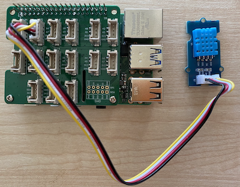

[](pi-temp.fr.md)
# Mesure de temperature - Raspberry Pi

Dans cette partie de la leçon, vous allez ajouter un capteur de température à votre Raspberry Pi.

## Matériel

La sonde que vous utiliserez est une [sonde d'humidité et de température DHT11](https://www.seeedstudio.com/Grove-Temperature-Humidity-Sensor-DHT11.html), combinant deux capteurs dans un même boîtier. Cette méthode est assez populaire, avec un certain nombre de capteurs disponibles dans le commerce combinant température, humidité et parfois pression atmosphérique. Le composant du capteur de température est une thermistance à coefficient de température négatif (CTN), une thermistance dont la résistance diminue lorsque la température augmente.

Il s'agit d'un capteur numérique, qui dispose donc d'un ADC intégré pour créer un signal numérique contenant les données de température et d'humidité que le microcontrôleur peut lire.

### Connecter le capteur de température

Le capteur de température Grove peut être connecté au Raspberry Pi.

#### Tâche

Connecter le capteur de température


1. Insérez une extrémité d'un câble Grove dans la prise du capteur d'humidité et de température. Il ne peut être inséré que dans un seul sens.

1. Lorsque le Raspberry Pi est hors tension, connectez l'autre extrémité du câble Grove à la prise numérique marquée **D5** sur le chapeau de la base Grove fixé au Pi. Cette prise est la deuxième en partant de la gauche, sur la rangée de prises à côté des broches GPIO.



## Programmez le capteur de température

L'appareil peut maintenant être programmé pour utiliser la sonde de température jointe.

### Tâche

Programmer le Raspberry Pi.

1. Brancher le Pi à l'alimentation et attendre la séquence de démarrage.

1. Lancez VS Code, soit directement sur le Pi, soit en vous connectant via l'extension SSH à distance.

    > ⚠️ Vous pouvez vous référer [aux instructions de configuration et de lancement de VS Code dans la leçon 1 si nécessaire].(../../../../1-getting-started/lessons/1-introduction-to-iot/pi.md).

1. Depuis le terminal, créez un nouveau dossier dans le répertoire personnel de l'utilisateur `pi` appelé `temperature-sensor`. Créez un fichier dans ce dossier appelé `app.py` :

    ```sh
    mkdir temperature-sensor
    cd temperature-sensor
    touch app.py
    ```

1. Ouvrez ce dossier dans VS Code

1. Pour utiliser le capteur de température et d'humidité, une librairie pip supplémentaire doit être installée. Depuis le Terminal dans VS Code, exécutez la commande suivante pour installer ce paquet Pip sur le Pi :

    ```sh
    pip3 install seeed-python-dht
    ```

1. Ajoutez le code suivant au fichier `app.py` pour importer les bibliothèques requises :

    ```python
    import time
    from seeed_dht import DHT
    ```

    L'instruction `from seeed_dht import DHT` importe la classe de capteur `DHT` pour interagir avec un capteur de température Grove du module `seeed_dht`.

1. Ajoutez le code suivant après le code ci-dessus pour créer une instance de la classe qui gère le capteur de température :

    ```python
    sensor = DHT("11", 5)
    ```

    Ceci déclare une instance de la classe `DHT` qui gère le capteur **D**igital **H**umidité et **T**température. Le premier paramètre indique au code que le capteur utilisé est le capteur *DHT11* - la bibliothèque que vous utilisez supporte d'autres variantes de ce capteur. Le deuxième paramètre indique au code que le capteur est connecté au port numérique `D5` du connecteur Grove de base.

    > ✅ N'oubliez pas que toutes les prises ont un numéro de broche unique. Les broches 0, 2, 4 et 6 sont des broches analogiques, les broches 5, 16, 18, 22, 24 et 26 sont des broches numériques.

1. Ajoutez une boucle infinie après le code ci-dessus pour interroger la valeur du capteur de température et l'imprimer sur la console :

    ```python
    while True:
        _, temp = sensor.read()
        print(f'Temperature {temp}°C')
    ```

    L'appel à `sensor.read()` renvoie un tuple d'humidité et de température. Vous n'avez besoin que de la valeur de la température, l'humidité est donc ignorée. La valeur de la température est ensuite imprimée sur la console.

1. Ajoutez une petite mise en veille de dix secondes à la fin de la "boucle", car les niveaux de température n'ont pas besoin d'être vérifiés en permanence. Une mise en veille réduit la consommation d'énergie de l'appareil.

    ```python
    time.sleep(10)
    ```

1. Depuis le terminal VS Code, exécutez ce qui suit pour lancer votre application Python :

    ```sh
    python3 app.py
    ```

    Vous devriez voir des valeurs de température en sortie sur la console. Utilisez quelque chose pour réchauffer le capteur, par exemple en appuyant votre pouce dessus, ou en utilisant un ventilateur pour voir les valeurs changer :

    ```output
    pi@raspberrypi:~/temperature-sensor $ python3 app.py 
    Temperature 26°C
    Temperature 26°C
    Temperature 28°C
    Temperature 30°C
    Temperature 32°C
    ```

> 💁 Vous pouvez trouver ce code dans le dossier [code-temperature/pi](../code-temperature/pi).

😀 La réalisation de votre programme de capteur de température a été un succès !
