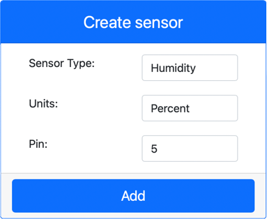
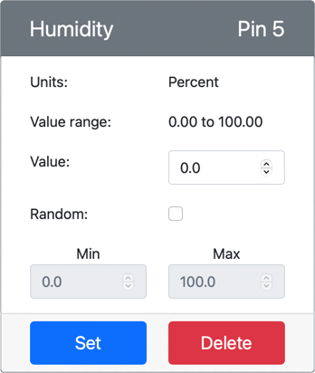

[](virtual-device-temp.fr.md)
# # Mesurer la température - Matériel virtuel IoT

Dans cette partie de la leçon, vous allez ajouter un capteur de température à votre dispositif IoT virtuel.

## Matériel virtuel

Le dispositif IoT virtuel utilisera un capteur numérique d'humidité et de température Grove simulé. Ce laboratoire est donc identique à celui qui utilise un Raspberry Pi avec un capteur Grove DHT11 physique.

Le capteur combine un **capteur de température** et un **capteur d'humidité**, mais dans ce laboratoire, vous n'êtes intéressé que par le composant capteur de température. Dans un dispositif IoT physique, le capteur de température serait une [thermistance] (https://wikipedia.org/wiki/Thermistor) qui mesure la température en détectant un changement de résistance lorsque la température change. Les capteurs de température sont généralement des capteurs numériques qui convertissent en interne la résistance mesurée en une température en degrés Celsius (ou Kelvin, ou Fahrenheit).

### Ajouter les capteurs à CounterFit

Pour utiliser un capteur d'humidité et de température virtuel, vous devez ajouter les deux capteurs à l'application CounterFit

#### Tâche - ajouter les capteurs à CounterFit

Ajoutez les capteurs d'humidité et de température à l'application CounterFit.

1. Créez une nouvelle application Python sur votre ordinateur dans un dossier appelé `temperature-sensor` avec un seul fichier appelé `app.py` et un environnement virtuel Python, et ajoutez les librairies pip de CounterFit.

    > ⚠️ Vous pouvez vous référer [aux instructions pour créer et configurer un projet Python CounterFit dans la leçon 1 si nécessaire](../../../../1-getting-started/lessons/1-introduction-to-iot/virtual-device.md).

1. Installez une librairie pip supplémentaire afin d'installer une cale CounterFit pour le capteur DHT11. Assurez-vous que vous l'installez depuis un terminal avec l'environnement virtuel activé.

    ```sh
    pip install counterfit-shims-seeed-python-dht
    ```

1. Assurez-vous que l'application web CounterFit est en cours d'exécution.

1. Créez un capteur d'humidité :

    1. Dans la case *Create sensor* du volet *Sensors*, déroulez la case *Sensor type* et sélectionnez *Humidity*.

    1. Laissez le paramètre *Units* à *Percentage*

    1. Assurez vous que la variable *Pin* est à *5*

    1. Sélectionnez le bouton **Add** pour créer le capteur d'humidité sur la broche 5

    

    Le capteur d'humidité sera créé et apparaîtra dans la liste des capteurs.

    

1. Créez un capteur de température :

    1. Dans la case *Create sensor* du volet *Sensors*, déroulez la case *Sensor type* et sélectionnez *Temperature*

    1. Laissez la variable *Units* à *Celsius*

    1. Assurez vous que la variable *Pin* est à *6*

    1. Sélectionnez le bouton **Add** pour créer le capteur de température sur la broche 6

    

    Le capteur de température sera créé et apparaîtra dans la liste des capteurs

    

## Programmez l'application de la sonde de température

L'application du capteur de température peut maintenant être programmée en utilisant les capteurs CounterFit.

### Tâche - programmer l'application du capteur de température

Programmez l'application du capteur de température.

1. Assurez-vous que l'application `temperature-sensor` est ouverte dans VS Code.

1. Ouvrez le fichier `app.py`.

1. Ajoutez le code suivant au début de `app.py` pour connecter l'application à CounterFit :

    ```python
    from counterfit_connection import CounterFitConnection
    CounterFitConnection.init('127.0.0.1', 5000)
    ```

1. Ajoutez le code suivant au fichier `app.py` pour importer les bibliothèques requises :

    ```python
    import time
    from counterfit_shims_seeed_python_dht import DHT
    ```

    L'instruction `from seeed_dht import DHT` importe la classe de capteur `DHT` pour interagir avec un capteur de température Grove virtuel utilisant une shim du module `counterfit_shims_seeed_python_dht`.

1. Ajoutez le code suivant après le code ci-dessus pour créer une instance de la classe qui gère le capteur virtuel d'humidité et de température :

    ```python
    sensor = DHT("11", 5)
    ```

    Ceci déclare une instance de la classe `DHT` qui gère le capteur virtuel **D**numérique **H**umidité et **T**température. Le premier paramètre indique au code que le capteur utilisé est un capteur virtuel *DHT11*. Le deuxième paramètre indique au code que le capteur est connecté au port `5`.

    > 💁 CounterFit simule ce capteur combiné d'humidité et de température en se connectant à 2 capteurs, un capteur d'humidité sur la broche donnée lors de la création de la classe `DHT`, et un capteur de température qui se trouve sur la broche suivante. Si le capteur d'humidité est sur la broche 5, la cale s'attend à ce que le capteur de température soit sur la broche 6.

1. Ajoutez une boucle infinie après le code ci-dessus pour interroger la valeur du capteur de température et l'imprimer sur la console :

    ```python
    while True:
        _, temp = sensor.read()
        print(f'Temperature {temp}°C')
    ```

    L'appel à `sensor.read()` renvoie un tuple d'humidité et de température. Vous n'avez besoin que de la valeur de la température, l'humidité est donc ignorée. La valeur de la température est ensuite imprimée sur la console.

1. Ajoutez une petite mise en veille de dix secondes à la fin de la "boucle", car les niveaux de température n'ont pas besoin d'être vérifiés en permanence. Une mise en veille réduit la consommation d'énergie de l'appareil.

    ```python
    time.sleep(10)
    ```

1. À partir du terminal VS Code avec un environnement virtuel activé, exécutez ce qui suit pour lancer votre application Python :

    ```sh
    python app.py
    ```

1. Depuis l'application CounterFit, modifiez la valeur de la sonde de température qui sera lue par l'application. Vous pouvez le faire de deux façons :

    * Entrez un nombre dans la case *Value* pour le capteur de température, puis sélectionnez le bouton **Set**. Le nombre que vous saisissez sera la valeur renvoyée par le capteur.

    * Cochez la case *Random* et saisissez une valeur *Min* et *Max*, puis sélectionnez le bouton **Set**. Chaque fois que le capteur lit une valeur, il lit un nombre aléatoire entre *Min* et *Max*.

    Vous devriez voir les valeurs que vous avez définies apparaître dans la console. Changez les paramètres *Value* ou *Random* pour voir la valeur changer.

    ```output
    (.venv) ➜  temperature-sensor python app.py
    Temperature 28.25°C
    Temperature 30.71°C
    Temperature 25.17°C
    ```

> 💁 Vous pouvez trouver ce code dans le fichier [code-temperature/virtual-device](../code-temperature/virtual-device).

😀 Votre programme de capteur de température a été un succès !
