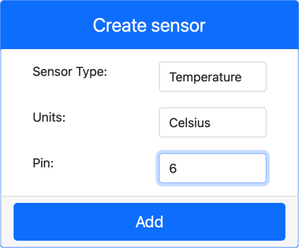
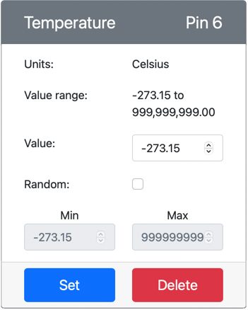

# Medir a temperatura - Hardware de IoT virtual

Nesta parte da lição, você adicionará um sensor de temperatura ao seu dispositivo IoT virtual.

## Hardware Virtual

O dispositivo IoT virtual usará um sensor de umidade e temperatura digital Grove simulado. Isso mantém este laboratório igual ao uso de um Raspberry Pi com um sensor físico Grove DHT11.

O sensor combina um **sensor de temperatura** com um **sensor de umidade**, mas neste laboratório você está interessado apenas no componente do sensor de temperatura. Em um dispositivo IoT físico, o sensor de temperatura seria um [termistor](https://wikipedia.org/wiki/Thermistor) que mede a temperatura detectando uma mudança na resistência à medida que a temperatura muda. Os sensores de temperatura geralmente são sensores digitais que convertem internamente a resistência medida em uma temperatura em graus Celsius (ou Kelvin ou Fahrenheit).

### Adicione os sensores ao CounterFit

Para usar um sensor virtual de umidade e temperatura, você precisa adicionar os dois sensores ao aplicativo CounterFit

#### Tarefa - adicione os sensores ao CounterFit

Adicione os sensores de umidade e temperatura ao aplicativo CounterFit.

1. Crie um novo aplicativo Python em seu computador em uma pasta chamada `temperature-sensor` com um único arquivo chamado `app.py` e um ambiente virtual Python, e adicione os pacotes pip CounterFit.

    > ⚠️ Você pode consultar [as instruções para criar e configurar um projeto CounterFit Python na lição 1, se necessário](../../../../1-getting-started/lessons/1-introduction-to-iot/translations/virtual-device.pt.md).

1. Instale um pacote Pip adicional para instalar um calço CounterFit para o sensor DHT11. Certifique-se de estar instalando isso de um terminal com o ambiente virtual ativado.

    ```sh
    pip install counterfit-shims-seeed-python-dht
    ```

1. Verifique se o aplicativo da web CounterFit está em execução

1. Crie um sensor de umidade:

    1. Na caixa *Criar sensor* no painel *Sensores*, abra a caixa *Tipo de sensor* e selecione *Umidade*.

    1. Deixe as *Unidades* definidas como *Porcentagem*

    1. Certifique-se de que o *Pino* esteja definido como *5*

    1. Selecione o botão **Adicionar** para criar o sensor de umidade no pino 5

    

    O sensor de umidade será criado e aparecerá na lista de sensores.

    

1. Crie um sensor de temperatura:

    1. Na caixa *Criar sensor* no painel *Sensores*, abra a caixa *Tipo de sensor* e selecione *Temperatura*.

    1. Deixe as *Unidades* definidas como *Celsius*

    1. Verifique se o *Pin* está definido como *6*

    1. Selecione o botão **Adicionar** para criar o sensor de temperatura no Pino 6

    

    O sensor de temperatura será criado e aparecerá na lista de sensores.

    

## Programe o aplicativo do sensor de temperatura

O aplicativo do sensor de temperatura agora pode ser programado usando os sensores CounterFit.

### Tarefa - programar o aplicativo do sensor de temperatura

Programe o aplicativo do sensor de temperatura.

1. Verifique se o aplicativo `temperature-sensor` está aberto no VS Code

1. Abra o arquivo `app.py`

1. Adicione o seguinte código na parte superior de `app.py` para conectar o aplicativo ao CounterFit:

    ```python
    from counterfit_connection import CounterFitConnection
    CounterFitConnection.init('127.0.0.1', 5000)
    ```

1. Adicione o seguinte código ao arquivo `app.py` para importar as bibliotecas necessárias:

    ```python
    import time
    from counterfit_shims_seeed_python_dht import DHT
    ```

    A instrução `from seeed_dht import DHT` importa a classe de sensor `DHT` para interagir com um sensor de temperatura Grove virtual usando um calço do módulo `counterfit_shims_seeed_python_dht`.

1. Adicione o seguinte código após o código acima para criar uma instância da classe que gerencia o sensor virtual de umidade e temperatura:

    ```python
    sensor = DHT("11", 5)
    ```

    Isso declara uma instância da classe `DHT` que gerencia o sensor virtual **D**igital **H** de umidade e **T** de temperatura. O primeiro parâmetro informa ao código que o sensor que está sendo usado é um sensor virtual *DHT11*. O segundo parâmetro informa ao código que o sensor está conectado à porta `5`.

    > 💁 O CounterFit simula este sensor combinado de umidade e temperatura conectando-se a 2 sensores, um sensor de umidade no pino fornecido quando a classe `DHT` é criada e um sensor de temperatura que é executado no próximo pino. Se o sensor de umidade estiver no pino 5, o calço espera que o sensor de temperatura esteja no pino 6.

1. Adicione um loop infinito após o código acima para pesquisar o valor do sensor de temperatura e imprimi-lo no console:

    ```python
    while True:
        _, temp = sensor.read()
        print(f'Temperature {temp}°C')
    ```

    A chamada para `sensor.read()` retorna uma tupla de umidade e temperatura. Você só precisa do valor da temperatura, então a umidade é ignorada. O valor da temperatura é então impresso no console.

1. Adicione um pequeno descanso de dez segundos no final do 'loop', pois os níveis de temperatura não precisam ser verificados continuamente. Uma suspensão reduz o consumo de energia do dispositivo.

    ```python
    time.sleep(10)
    ```

1. No Terminal do VS Code com um ambiente virtual ativado, execute o seguinte para executar seu aplicativo Python:

    ```sh
    python app.py
    ```

1. A partir do aplicativo CounterFit, altere o valor do sensor de temperatura que será lido pelo aplicativo. Você pode fazer isso de duas maneiras:

     * Insira um número na caixa *Value* para o sensor de temperatura e selecione o botão **Set**. O número que você inserir será o valor retornado pelo sensor.

     * Marque a caixa de seleção *Random* e insira um valor *Min* e *Max* e selecione o botão **Set**. Cada vez que o sensor lê um valor, ele lê um número aleatório entre *Min* e *Max*.

     Você deve ver os valores que definiu aparecendo no console. Altere as configurações de *Value* ou *Random* para ver a alteração do valor.

    ```output
    (.venv) ➜  temperature-sensor python app.py
    Temperature 28.25°C
    Temperature 30.71°C
    Temperature 25.17°C
    ```

> 💁 Você pode encontrar esse código na pasta [code-temperature/virtual-device](../code-temperature/virtual-device).

😀 Seu programa de sensor de temperatura foi um sucesso!
