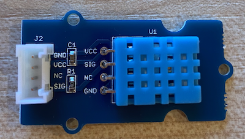
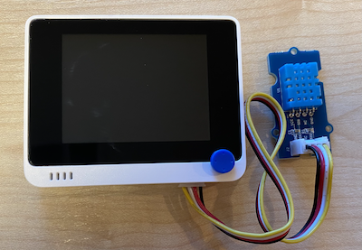

[](translations/wio-terminal-temp.fr.md)
# Measure temperature - Wio Terminal

In this part of the lesson, you will add a temperature sensor to your Wio Terminal, and read temperature values from it.

## Hardware

The Wio Terminal needs a temperature sensor.

The sensor you'll use is a [DHT11 humidity and temperature sensor](https://www.seeedstudio.com/Grove-Temperature-Humidity-Sensor-DHT11.html), combining 2 sensors in one package. This is fairly popular, with a number of commercially available sensors combining temperature, humidity and sometimes atmospheric pressure. The temperature sensor component is a negative temperature coefficient (NTC) thermistor, a thermistor where the resistance decreases as the temperature increases.

This is a digital sensor, so has an onboard ADC to create a digital signal containing the temperature and humidity data that the microcontroller can read.

### Connect the temperature sensor

The Grove temperature sensor can be connected to the Wio Terminals digital port.

#### Task - connect the temperature sensor

Connect the temperature sensor.



1. Insert one end of a Grove cable into the socket on the humidity and temperature sensor. It will only go in one way round.

1. With the Wio Terminal disconnected from your computer or other power supply, connect the other end of the Grove cable to the right-hand side Grove socket on the Wio Terminal as you look at the screen. This is the socket farthest away from the power button.



## Program the temperature sensor

The Wio Terminal can now be programmed to use the attached temperature sensor.

### Task program the temperature sensor

Program the device.

1. Create a brand new Wio Terminal project using PlatformIO. Call this project `temperature-sensor`. Add code in the `setup` function to configure the serial port.

    > ⚠️ You can refer to [the instructions for creating a PlatformIO project in project 1, lesson 1 if needed](../../../1-getting-started/lessons/1-introduction-to-iot/wio-terminal.md#create-a-platformio-project).

1. Add a library dependency for the Seeed Grove Humidity and Temperature sensor library to the projects `platformio.ini` file:

    ```ini
    lib_deps =
        seeed-studio/Grove Temperature And Humidity Sensor @ 1.0.1
    ```

    > ⚠️ You can refer to [the instructions for adding libraries to a PlatformIO project in project 1, lesson 4 if needed](../../../1-getting-started/lessons/4-connect-internet/wio-terminal-mqtt.md#install-the-wifi-and-mqtt-arduino-libraries).

1. Add the following `#include` directives to the top of the file, under the existing `#include <Arduino.h>`:

    ```cpp
    #include <DHT.h>
    #include <SPI.h>
    ```

    This imports files needed to interact with the sensor. The `DHT.h` header file contains the code for the sensor itself, and adding the `SPI.h` header ensures the code needed to talk to the sensor is linked in when the app is compiled.

1. Before the`setup` function, declare the DHT sensor:

    ```cpp
    DHT dht(D0, DHT11);
    ```

    This declares an instance of the `DHT` class that manages the **D**igital **H**umidity and **T**emperature sensor. This is connected to port `D0`, the right-hand-side Grove socket on the Wio Terminal. The second parameter tells the code the sensor being used is the *DHT11* sensor - the library you are using supports other variants of this sensor.

1. In the `setup` function, add code to set up the serial connection:

    ```cpp
    void setup()
    {
        Serial.begin(9600);
    
        while (!Serial)
            ; // Wait for Serial to be ready
    
        delay(1000);
    }
    ```

1. At the end of the `setup` function, after the last `delay`, add a call to start the DHT sensor:

    ```cpp
    dht.begin();
    ```

1. In the `loop` function, add code to call the sensor and print the temperature to the serial port:

    ```cpp
    void loop()
    {
        float temp_hum_val[2] = {0};
        dht.readTempAndHumidity(temp_hum_val);
        Serial.print("Temperature: ");
        Serial.print(temp_hum_val[1]);
        Serial.println ("°C");
    
        delay(10000);
    }
    ```

    This code declares an empty array of 2 floats, and passes this to the call to `readTempAndHumidity` on the `DHT` instance. This call populates the array with 2 values - the humidity goes in the 0th item in the array (remember in C++ arrays are 0-based, so the 0th item is the 'first' item in the array), and the temperature goes into the 1st item.

    The temperature is read from the 1st item in the array, and printed to the serial port.

    > 🇺🇸 The temperature is read in Celsius. For Americans, to convert this to Fahrenheit, divide the Celsius value read by 5, then multiply by 9, then add 32. For example, a temperature reading of 20°C becomes ((20/5)*9) + 32 = 68°F.

1. Build and upload the code to the Wio Terminal.

    > ⚠️ You can refer to [the instructions for creating a PlatformIO project in project 1, lesson 1 if needed](../../../1-getting-started/lessons/1-introduction-to-iot/wio-terminal.md#write-the-hello-world-app).

1. Once uploaded, you can monitor the temperature using the serial monitor:

    ```output
    > Executing task: platformio device monitor <
    
    --- Available filters and text transformations: colorize, debug, default, direct, hexlify, log2file, nocontrol, printable, send_on_enter, time
    --- More details at http://bit.ly/pio-monitor-filters
    --- Miniterm on /dev/cu.usbmodem1201  9600,8,N,1 ---
    --- Quit: Ctrl+C | Menu: Ctrl+T | Help: Ctrl+T followed by Ctrl+H ---
    Temperature: 25.00°C
    Temperature: 25.00°C
    Temperature: 25.00°C
    Temperature: 24.00°C
    ```

> 💁 You can find this code in the [code-temperature/wio-terminal](code-temperature/wio-terminal) folder.

😀 Your temperature sensor program was a success!
