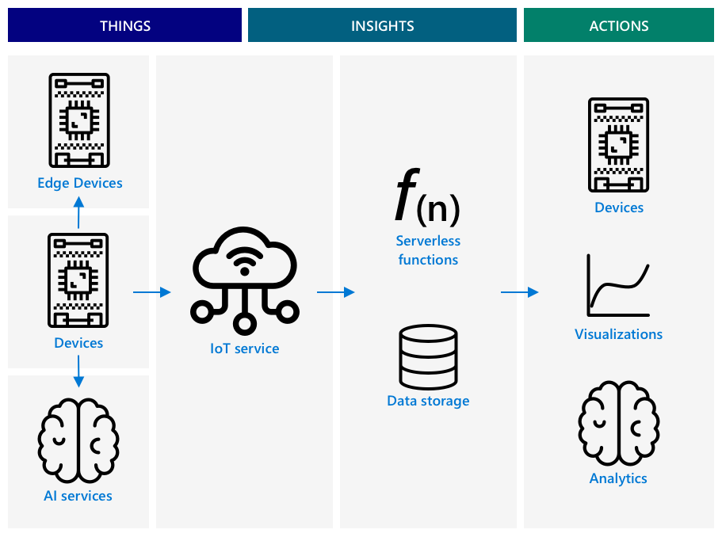
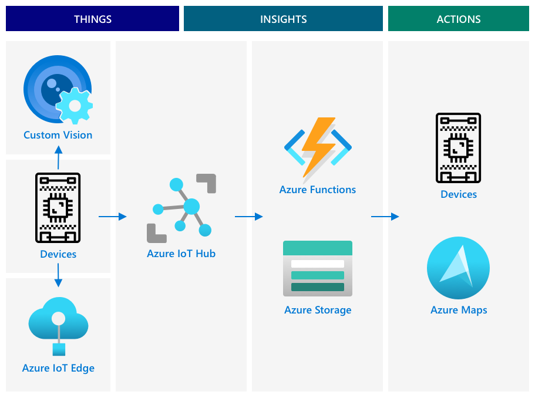
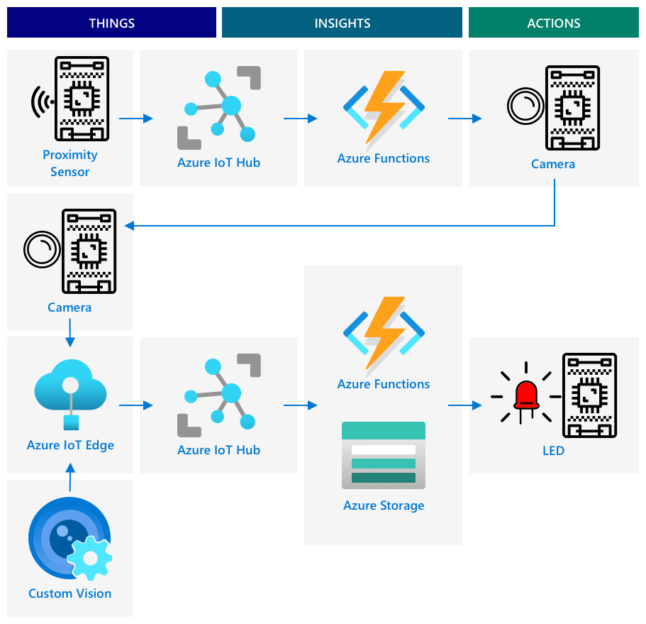
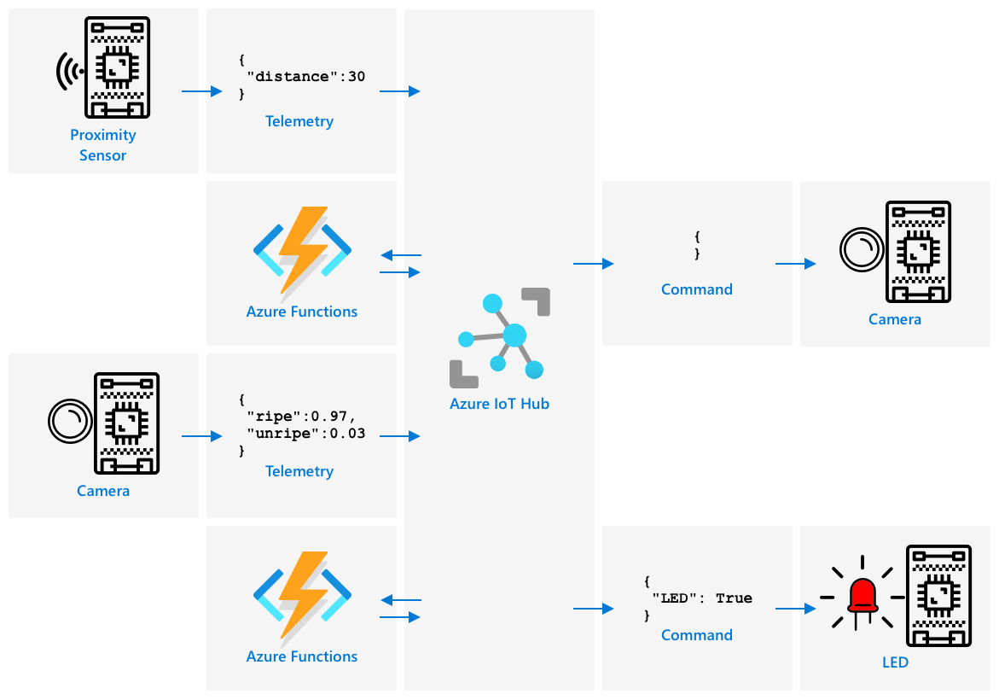

# Trigger fruit quality detection from a sensor

Add a sketchnote if possible/appropriate


## Pre-lecture quiz

[Pre-lecture quiz](https://brave-island-0b7c7f50f.azurestaticapps.net/quiz/35)

## Introduction

An IoT application is not just a single device capturing data and sending it to the cloud, it is more often that not multiple devices all working together to capture data from the physical world using sensors, make decisions based off that data, and interacting back with the physical world via actuators or visualizations.

In this lesson you will learn more about architecting complex IoT applications, incorporating multiple sensors, multiple cloud services to analyze and store data, and showing a response via an actuator. You will learn how to architect a fruit quality control system prototype, including about using proximity sensors to trigger the IoT application, and what the architecture of this prototype would be.

In this lesson we'll cover:

* [Architect complex IoT applications](#architect-complex-iot-applications)
* [Design a fruit quality control system](#design-a-fruit-quality-control-system)
* [Trigger fruit quality checking from a sensor](#trigger-fruit-quality-checking-from-a-sensor)
* [Data used for a fruit quality detector](#data-used-for-a-fruit-quality-detector)
* [Using developer devices to simulate multiple IoT devices](#using-developer-devices-to-simulate-multiple-iot-devices)
* [Moving to production](#moving-to-production)

> 🗑 This is the last lesson in this project, so after completing this lesson and the assignment, don't forget to clean up your cloud services. You will need the services to complete the assignment, so make sure to complete that first.
>
> Refer to [the clean up your project guide](../../../clean-up.md) if necessary for instructions on how to do this.

## Architect complex IoT applications

IoT applications are made up of many components. This includes a variety of things, and a variety of internet services.

IoT applications can be described as *things* (devices) sending data that generates *insights*. These *insights* generate *actions* to improve a business or process. An example is an engine (the thing) sending temperature data. This data is used to evaluate whether the engine is performing as expected (the insight). The insight is used to proactively prioritize the maintenance schedule for the engine (the action).

* Different things gather different pieces of data.
* IoT services give insights over that data, sometimes augmenting it with data from additional sources.
* These insights drive actions, including controlling actuators in devices, or visualizing data.

### Reference IoT architecture



***A reference iot architecture. Microcontroller by Template / IoT by Adrien Coquet / Brain by Icon Market - all from the [Noun Project](https://thenounproject.com)***

The diagram above shows a reference IoT architecture.

> 🎓 A *reference architecture* is an example architecture you can use as a reference when designing new systems. In this case, if you were building a new IoT system you can follow the reference architecture, substituting your own devices and services where appropriate.

* **Things** are devices that gather data from sensors, maybe interacting with edge services to interpret that data, such as image classifiers to interpret image data. The data from the devices is sent to an IoT service.
* **Insights** come from serverless applications, or from analytics run on stored data.
* **Actions** can be commands sent to devices, or visualization of data allowing humans to make decisions.



***A reference iot architecture. Microcontroller by Template - all from the [Noun Project](https://thenounproject.com)***

The diagram above shows some of the components and services covered so far in these lessons and how the link together in a reference IoT architecture.

* **Things** - you've written device code to capture data from sensors, and analyse images using Custom Vision running both in the cloud and on an edge device. This data was sent to IoT Hub.
* **Insights** - you've used Azure Functions to respond to messages sent to an IoT Hub, and stored data for later analysis in Azure Storage.
* **Actions** - you've controlled actuators based on decisions made in the cloud and commands sent to the devices, and you've visualized data using Azure Maps.


✅ Think about other IoT devices you have used, such as smart home appliances. What are the things, insights and actions involved in that device and it's software?

This pattern can be scaled out as large or small as you need, adding more devices and more services.

### Data and security

As you define the architecture of your system, you need to constantly consider data and security.

* What data does your device send and receive?
* How should that data be secured and protected?
* How should access to the device and cloud service be controlled?

✅ Think about the data security of any IoT devices you own. How much of that data is personal and should be kept private, both in transit or when stored? What data should not be stored?

## Design a fruit quality control system

Let's now take this idea of things, insights, and actions and apply it to our fruit quality detector to design a larger end-to-end application.

Imagine you have been given the task of building a fruit quality detector to be used in a processing plant. Fruit travels on a conveyer belt system where currently employees spend time checking the fruit by hand and removing any unripe fruit as it arrives. To reduce costs, the plant owner wants an automated system.

✅ One of the trends with the rise of IoT (and technology in general) is that manual jobs are being replaced by machines. Do some research: How many jobs are estimated to be lost to IoT? How many new jobs will be created building IoT devices?

You need to build a system where fruit is detected as it arrives on the conveyer belt, it is then photographed and checked using an AI model running on the edge. The results are then sent to the cloud to be stored, and if the fruit is unripe a notification is given so the unripe fruit can be removed.

|   |   |
| - | - |
| **Things** | Detector for fruit arriving on the conveyor belt<br>Camera to photograph and classify the fruit<br>Edge device running the classifier<br>Device to notify of unripe fruit |
| **Insights** | Decide to check the ripeness of the fruit<br>Store the results of the ripeness classification<br>Determine if there is a need to alert about unripe fruit |
| **Actions** | Send a command to a device to photograph the fruit and check it with an image classifier<br>Send a command to a device to alert that the fruit is unripe |

### Prototyping your application



***A reference iot architecture for fruit quality checking. LED by abderraouf omara / Microcontroller by Template - all from the [Noun Project](https://thenounproject.com)***

The diagram above shows a reference architecture for this prototype application.

* An IoT device with a proximity sensor detects the arrival of fruit. This sends a message to the cloud to say fruit has been detected.
* A serverless application in the cloud sends a command to another device to take a photograph and classify the image.
* An IoT device with a camera takes a picture and sends it to an image classifier running on the edge. The results are then sent to the cloud.
* A serverless application in the cloud stores this information to be analyzed later to see what percentage of fruit is unripe. If the fruit is unripe it sends a command to another iot device to alert factory workers there is unripe fruit via an LED.

> 💁 This entire IoT application could be implemented as a single device, with all the logic to start the image classification and control the LED built in. It could use an IoT Hub just to track the number of unripe fruits detected and configure the device. In this lesson it is expanded to demonstrate the concepts for large scale IoT applications.

For the prototype, you will implement all of this on a single device. If you are using a microcontroller then you will use a separate edge device to run the image classifier. You have already learned most of the things you will need to be able to build this.

## Trigger fruit quality checking from a sensor

The IoT device needs some kind of trigger to indicate when fruit is ready to be classified. One trigger for this would be to measure when the fruit is at the right location on the conveyor belt my measuring the distance to a sensor.


***Proximity sensors send laser beams to objects like bananas and time how long till the beam is bounced back. Bananas by abderraouf omara / Microcontroller by Template - all from the [Noun Project](https://thenounproject.com)***

Proximity sensors can be used to measure the distance from the sensor to an object. They usually transmit a beam of electromagnetic radiation such as a laser beam or infra-red light, then detect the radiation bouncing off an object. The time between the laser beam being sent and the signal bouncing back can be used to calculate the distance to the sensor.

> 💁 You have probably used proximity sensors without even knowing about it. Most smartphone will turn the screen off when you hold them to your ear to stop you accidentally ending a call with your earlobe, and this works using a proximity sensor, detecting an object close to the screen during a call and disabling the touch capabilities until the phone is a certain distance away.

### Task - trigger fruit quality detection from a distance sensor

Work through the relevant guide to use a proximity sensor to detect an object using your IoT device:

* [Arduino - Wio Terminal](wio-terminal-proximity.md)
* [Single-board computer - Raspberry Pi](pi-proximity.md)
* [Single-board computer - Virtual device](virtual-device-proximity.md)

## Data used for a fruit quality detector

The prototype fruit detector has multiple components communicating with each other.



* A proximity sensor measuring the distance to a piece of fruit and sending this to IoT Hub
* The command to control the camera coming from IoT Hub to the camera device
* The results of the image classification being sent to IoT Hub
* The command to control an LED to alert when the fruit is unripe being sent from IoT Hub to the device with the LED

It is good to define the structure of these messages up front, before you build out the application.

> 💁 Pretty much every experienced developer has at some point in their career spent hours, days or even weeks chasing down bugs caused by differences in the data being sent compared to what is expected.

For example - if you are sending temperature information, how would you define the JSON? You could have a field called `temperature`, or you could use the common abbreviation `temp`.

```json
{
    "temperature": 20.7
}
```

compared to:

```json
{
    "temp": 20.7
}
```

You also have to consider units - is the temperature in °C or °F? If you are measuring temperature using a consumer device and they change the display units, you need to make sure the units sent to the cloud remain consistent.

✅ Do some research: How did unit problems cause the $125 million Mars Climate Orbiter to crash?

Think about the data being sent for the fruit quality detector. How would you define each message? Where would you analyze the data and make decisions about what data to send?

For example - triggering the image classification using the proximity sensor. The IoT device measures the distance, but where is the decision made? Does the device decide that the fruit is close enough and sends a message to tell the IoT Hub to trigger the classification? Or does it send proximity measurements and let the IoT Hub decide?

The answer to questions like this is - it depends. Each use case is different, which is why as an IoT developer you need to understand the system you are building, how it is used, and the data being detected.

* If the decision is made by the IoT Hub, you need to send multiple distance measurements.
* If you send too many messages, it increases the cost of the IoT Hub, and the amount of bandwidth needed by your IoT devices (especially in a factory with millions of devices). It can also slow down your device.
* If you make the decision on the device, you will need to provide a way to configure the device to fine tune the machine.

## Using developer devices to simulate multiple IoT devices

To build your prototype, you will need your IoT dev kit to act like multiple devices, sending telemetry and responding to commands.

### Simulating multiple IoT devices on a Raspberry Pi or virtual IoT hardware

When using a single board computer like a Raspberry Pi, you are able to run multiple applications at once. This means you can simulate multiple IoT devices by creating multiple applications, one per 'IoT device'. For example, you can implement each device as a separate Python file and run them in different terminal sessions.

> 💁 Be aware that some hardware won't work when being accessed by multiple applications running simultaneously.

### Simulating multiple devices on a microcontroller

Microcontrollers are more complicated to simulate multiple devices. Unlike single board computers you cannot run multiple applications at once, you have to include all the logic for all the separate IoT devices in a single application.

Some suggestions to make this process easier are:

* Create one or more classes per IoT device - for example classes called `DistanceSensor`, `ClassifierCamera`, `LEDController`. Each one can have it's own `setup` and `loop` methods called by the main `setup` and `loop` functions.
* Handle commands in a single place, and direct them to the relevant device class as required.
* In the main `loop` function, you will need to consider the timing for each different device. For example, if you have one device class that needs to process every 10 seconds, and another that needs to process every 1 second, then in your main `loop` function use a 1 second delay. Every `loop` call triggers the relevant code for the device that needs to process every second, and use a counter to count each loop, processing the other device when the counter reaches 10 (resetting the counter afterwards).

## Moving to production

The prototype will form the basis of a final production system. Some of the differences when you move to production would be:

* Ruggedized components - using hardware designed to withstand the noise, heat, vibration and stress of a factory.
* Using internal communications - some of the components would communicate directly avoiding the hop to the cloud, only sending data to the cloud to be stored. How this is done depends on the factory setup, with either direct communications, or by running part of the IoT service on the edge using a gateway device.
* Configuration options - each factory and use case is different, so the hardware would need to be configurable. For example, the proximity sensor may need to detect different fruit at different distances. Rather than hard code the distance to trigger the classification, you would want this to be configurable via the could, for example using a device twin
* Automated fruit removal - instead of an LED to alert that fruit is unripe, automated devices would remove it.

✅ Do some research: In what other ways would production devices differ from developer kits?

---

## 🚀 Challenge

In this lesson you have learned some of the concepts you need to know on how to architect an IoT system. Think back to the previous projects. How would do they fit into the reference architecture shown above?

Pick one of the projects so far and think of the design of a more complicated solution bringing together multiple capabilities beyond what was covered in the projects. Draw the architecture and think of all the devices and services you would need.

For example - a vehicle tracking device that combines GPS with sensors to monitor things like temperatures in a refrigerated truck, the engine on and off times, and the identity of the driver. What are the devices involved, the services involved, the data being transmitted and the security and privacy considerations?

## Post-lecture quiz

[Post-lecture quiz](https://brave-island-0b7c7f50f.azurestaticapps.net/quiz/36)

## Review & Self Study

* Read more about IoT architecture on the [Azure IoT reference architecture documentation on Microsoft docs](https://docs.microsoft.com/azure/architecture/reference-architectures/iot?WT.mc_id=academic-17441-jabenn)
* Read more about device twins in the [understand and use device twins in IoT Hub documentation on Microsoft docs](https://docs.microsoft.com/azure/iot-hub/iot-hub-devguide-device-twins?WT.mc_id=academic-17441-jabenn)
* Read about OPC-UA, a machine to machine communication protocol used in industrial automation on the [OPC-UA page on Wikipedia](https://wikipedia.org/wiki/OPC_Unified_Architecture)

## Assignment

[Build a fruit quality detector](assignment.md)
