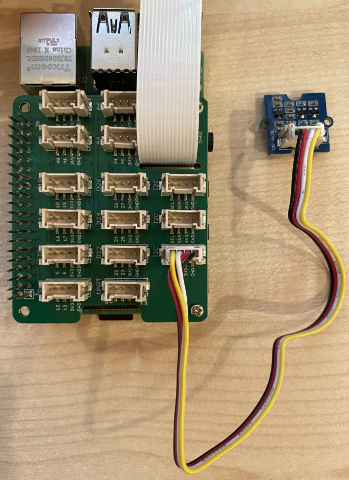

# Detect proximity - Raspberry Pi

In this part of the lesson, you will add a proximity sensor to your Raspberry Pi, and read distance from it.

## Hardware

The Raspberry Pi needs a proximity sensor.

The sensor you'll use is a [Grove Time of Flight distance sensor](https://www.seeedstudio.com/Grove-Time-of-Flight-Distance-Sensor-VL53L0X.html). This sensor uses a laser ranging module to detect distance. This sensor has a range of 10mm to 2000mm (1cm - 2m), and will report values in that range pretty accurately, with distances above 1000mm reported as 8109mm.

The laser rangefinder is on the back of the sensor, the opposite side to the Grove socket.

This is an I<sup>2</sup>C sensor.

### Connect the time of flight sensor

The Grove time of flight sensor can be connected to the Raspberry Pi.

#### Task - connect the time of flight sensor

Connect the time of flight sensor.


1. Insert one end of a Grove cable into the socket on the time of flight sensor. It will only go in one way round.

1. With the Raspberry Pi powered off, connect the other end of the Grove cable to one of the I<sup>2</sup>C sockets marked **I<sup>2</sup>C** on the Grove Base hat attached to the Pi. These sockets are on the bottom row, the opposite end to the GPI pins and next to the camera cable slot.



## Program the time of flight sensor

The Raspberry Pi can now be programmed to use the attached time of flight sensor.

### Task - program the time of flight sensor

Program the device.

1. Power up the Pi and wait for it to boot.

1. Open the `fruit-quality-detector` code in VS Code, either directly on the Pi, or connect via the Remote SSH extension.

1. Install the rpi-vl53l0x Pip package, a Python package that interacts with a VL53L0X time-of-flight distance sensor. Install it using this pip command
    ```sh
        pip install rpi-vl53l0x
    ```

1. Create a new file in this project called `distance-sensor.py`.

    > 💁 An easy way to simulate multiple IoT devices is to do each in a different Python file, then run them at the same time.

1. Add the following code to this file:

    ```python
    import time
    
    from grove.i2c import Bus
    from rpi_vl53l0x.vl53l0x import VL53L0X
    ```

    This imports the Grove I<sup>2</sup>C bus library, and a sensor library for the core sensor hardware built into the Grove time of flight sensor.

1. Below this, add the following code to access the sensor:

    ```python
    distance_sensor = VL53L0X(bus = Bus().bus)
    distance_sensor.begin()    
    ```

    This code declares a distance sensor using the Grove I<sup>2</sup>C bus, then starts the sensor.

1. Finally, add an infinite loop to read distances:

    ```python
    while True:
        distance_sensor.wait_ready()
        print(f'Distance = {distance_sensor.get_distance()} mm')
        time.sleep(1)
    ```

    This code waits for a value to be ready to read from the sensor, then prints it to the console.

1. Run this code.

    > 💁 Don't forget this file is called `distance-sensor.py`! Make sure to run this via Python, not `app.py`.

1. You will see distance measurements appear in the console. Position objects near the sensor and you will see the distance measurement:

    ```output
    pi@raspberrypi:~/fruit-quality-detector $ python3 distance_sensor.py 
    Distance = 29 mm
    Distance = 28 mm
    Distance = 30 mm
    Distance = 151 mm
    ```

    The rangefinder is on the back of the sensor, so make sure you use the correct side when measuring distance.

    

> 💁 You can find this code in the [code-proximity/pi](code-proximity/pi) folder.

😀 Your proximity sensor program was a success!