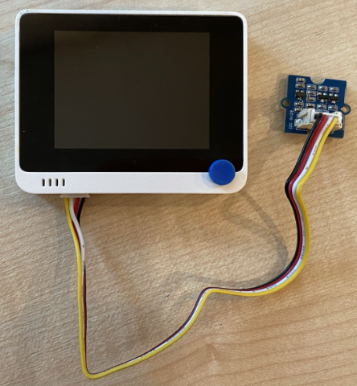

# Detect proximity - Wio Terminal

In this part of the lesson, you will add a proximity sensor to your Wio Terminal, and read distance from it.

## Hardware

The Wio Terminal needs a proximity sensor.

The sensor you'll use is a [Grove Time of Flight distance sensor](https://www.seeedstudio.com/Grove-Time-of-Flight-Distance-Sensor-VL53L0X.html). This sensor uses a laser ranging module to detect distance. This sensor has a range of 10mm to 2000mm (1cm - 2m), and will report values in that range pretty accurately, with distances above 1000mm reported as 8109mm.

The laser rangefinder is on the back of the sensor, the opposite side to the Grove socket.

This is an I2C sensor.

### Connect the time of flight sensor

The Grove time of flight sensor can be connected to the Wio Terminal.

#### Task - connect the time of flight sensor

Connect the time of flight sensor.

1. Insert one end of a Grove cable into the socket on the time of flight sensor. It will only go in one way round.

1. With the Wio Terminal disconnected from your computer or other power supply, connect the other end of the Grove cable to the left-hand side Grove socket on the Wio Terminal as you look at the screen. This is the socket closest to from the power button. This is a combined digital and I2C socket.

1. You can now connect the Wio Terminal to your computer.

## Program the time of flight sensor

The Wio Terminal can now be programmed to use the attached time of flight sensor.

### Task - program the time of flight sensor

1. Open the `fruit-quality-detector` application in VS Code