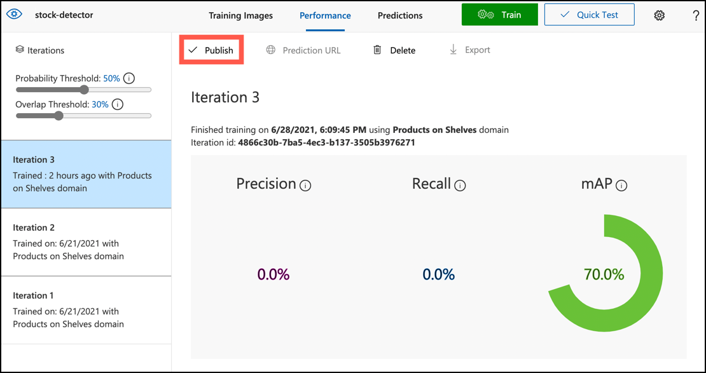

# Check stock from an IoT device

Add a sketchnote if possible/appropriate


## Pre-lecture quiz

[Pre-lecture quiz](https://brave-island-0b7c7f50f.azurestaticapps.net/quiz/39)

## Introduction

In the previous lesson you learned about the different uses of object detection in retail. You also learned how to train an object detector to identify stock. In this lesson you will learn how to use your object detector from your IoT device to count stock.

In this lesson we'll cover:

* [Stock counting](#stock-counting)
* [Call your object detector from your IoT device](#call-your-object-detector-from-your-iot-device)
* [Bounding boxes](#bounding-boxes)
* [Count stock](#count-stock)

## Stock counting

Object detectors can be used for stock checking, either counting stock or ensuring stock is where it should be. IoT devices with cameras can be deployed all around the store to monitor stock, starting with hot spots where having items restocked is important, such as areas where small numbers of high value items are stocked.

For example, if a camera is pointing at a set of shelves that can hold 8 cans of tomato paste, and an object detector only detects 7 cans, then one is missing and needs to be restocked.


In the above image, an object detector has detected 7 cans of tomato paste on a shelf that can hold 8 cans. Not only can the IoT device send a notification of the need to restock, but it can even give an indication of the location of the missing item, important data if you are using robots to restock shelves.

> 💁 Depending on the store and popularity of the item, restocking probably wouldn't happen if only 1 can was missing. You would need to build an algorithm that determines when to restock based on your produce, customers and other criteria.

✅ In what other scenarios could you combine object detection and robots?

Sometimes the wrong stock can be on the shelves. This could be human error when restocking, or customers changing their mind on a purchase and putting an item back in the first available space. When this is a non-perishable item such as canned goods, this is an annoyance. If it is a perishable item such as frozen or chilled goods, this can mean that the product can no longer be sold as it might be impossible to tell how long the item was out of the freezer.

Object detection can be used to detect unexpected items, again alerting a human or robot to return the item as soon as it is detected.


In the above image, a can of baby corn has been put on the shelf next to the tomato paste. The object detector has detected this, allowing the IoT device to notify a human or robot to return the can to it's correct location.

## Call your object detector from your IoT device

The object detector you trained in the last lesson can be called from your IoT device.

### Task - publish an iteration of your object detector

Iterations are published from the Custom Vision portal.

1. Launch the Custom Vision portal at [CustomVision.ai](https://customvision.ai) and sign in if you don't have it open already. Then open your `stock-detector` project.

1. Select the **Performance** tab from the options at the top

1. Select the latest iteration from the *Iterations* list on the side

1. Select the **Publish** button for the iteration

    

1. In the *Publish Model* dialog, set the *Prediction resource* to the `stock-detector-prediction` resource you created in the last lesson. Leave the name as `Iteration2`, and select the **Publish** button.

1. Once published, select the **Prediction URL** button. This will show details of the prediction API, and you will need these to call the model from your IoT device. The lower section is labelled *If you have an image file*, and this is the details you want. Take a copy of the URL that is shown which will be something like:

    ```output
    https://<location>.api.cognitive.microsoft.com/customvision/v3.0/Prediction/<id>/detect/iterations/Iteration2/image
    ```

    Where `<location>` will be the location you used when creating your custom vision resource, and `<id>` will be a long ID made up of letters and numbers.

    Also take a copy of the *Prediction-Key* value. This is a secure key that you have to pass when you call the model. Only applications that pass this key are allowed to use the model, any other applications are rejected.

    

✅ When a new iteration is published, it will have a different name. How do you think you would change the iteration an IoT device is using?

### Task - call your object detector from your IoT device

Follow the relevant guide below to use the object detector from your IoT device:

* [Arduino - Wio Terminal](wio-terminal-object-detector.md)
* [Single-board computer - Raspberry Pi/Virtual device](single-board-computer-object-detector.md)

## Bounding boxes

## Count stock

### Task - count stock

---

## 🚀 Challenge

## Post-lecture quiz

[Post-lecture quiz](https://brave-island-0b7c7f50f.azurestaticapps.net/quiz/40)

## Review & Self Study

## Assignment

[Use your object detector on the edge](assignment.md)
