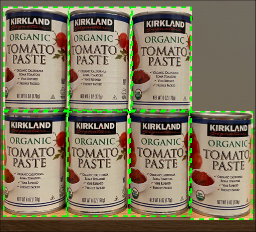
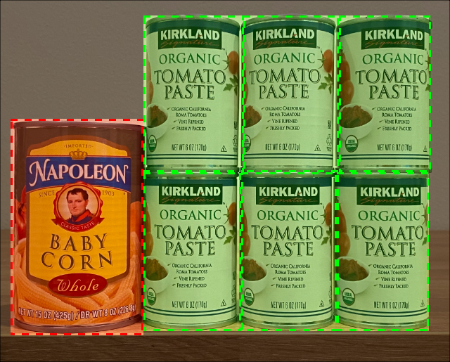
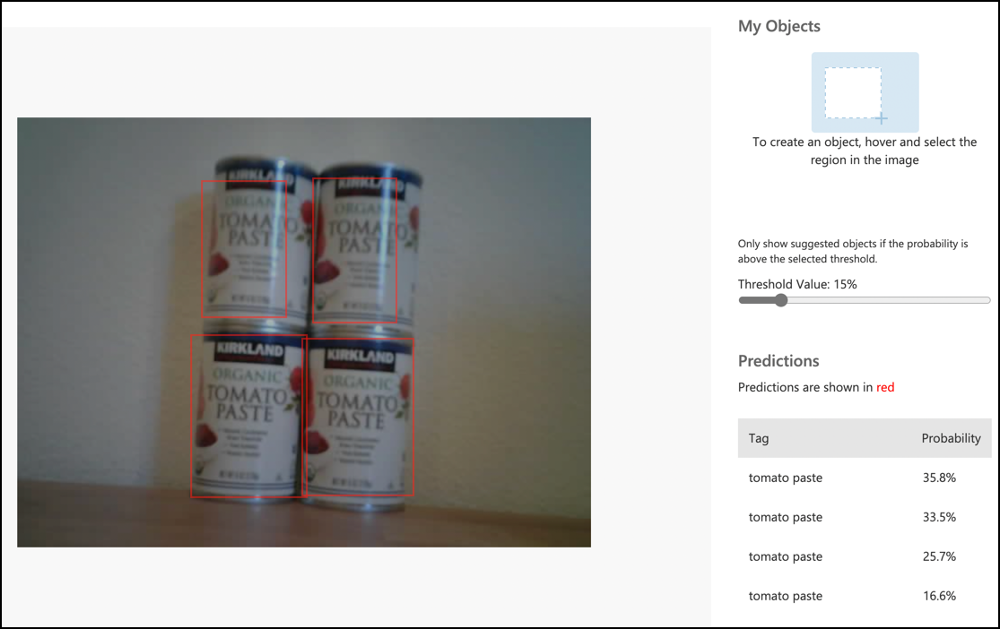
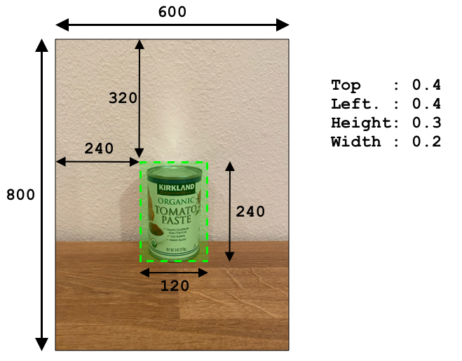
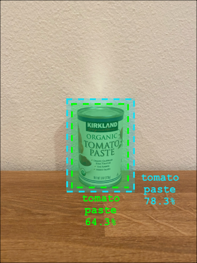

# Check stock from an IoT device

Add a sketchnote if possible/appropriate


## Pre-lecture quiz

[Pre-lecture quiz](https://brave-island-0b7c7f50f.azurestaticapps.net/quiz/39)

## Introduction

In the previous lesson you learned about the different uses of object detection in retail. You also learned how to train an object detector to identify stock. In this lesson you will learn how to use your object detector from your IoT device to count stock.

In this lesson we'll cover:

* [Stock counting](#stock-counting)
* [Call your object detector from your IoT device](#call-your-object-detector-from-your-iot-device)
* [Bounding boxes](#bounding-boxes)
* [Retrain the model](#retrain-the-model)
* [Count stock](#count-stock)

## Stock counting

Object detectors can be used for stock checking, either counting stock or ensuring stock is where it should be. IoT devices with cameras can be deployed all around the store to monitor stock, starting with hot spots where having items restocked is important, such as areas where small numbers of high value items are stocked.

For example, if a camera is pointing at a set of shelves that can hold 8 cans of tomato paste, and an object detector only detects 7 cans, then one is missing and needs to be restocked.



In the above image, an object detector has detected 7 cans of tomato paste on a shelf that can hold 8 cans. Not only can the IoT device send a notification of the need to restock, but it can even give an indication of the location of the missing item, important data if you are using robots to restock shelves.

> 💁 Depending on the store and popularity of the item, restocking probably wouldn't happen if only 1 can was missing. You would need to build an algorithm that determines when to restock based on your produce, customers and other criteria.

✅ In what other scenarios could you combine object detection and robots?

Sometimes the wrong stock can be on the shelves. This could be human error when restocking, or customers changing their mind on a purchase and putting an item back in the first available space. When this is a non-perishable item such as canned goods, this is an annoyance. If it is a perishable item such as frozen or chilled goods, this can mean that the product can no longer be sold as it might be impossible to tell how long the item was out of the freezer.

Object detection can be used to detect unexpected items, again alerting a human or robot to return the item as soon as it is detected.



In the above image, a can of baby corn has been put on the shelf next to the tomato paste. The object detector has detected this, allowing the IoT device to notify a human or robot to return the can to it's correct location.

## Call your object detector from your IoT device

The object detector you trained in the last lesson can be called from your IoT device.

### Task - publish an iteration of your object detector

Iterations are published from the Custom Vision portal.

1. Launch the Custom Vision portal at [CustomVision.ai](https://customvision.ai) and sign in if you don't have it open already. Then open your `stock-detector` project.

1. Select the **Performance** tab from the options at the top

1. Select the latest iteration from the *Iterations* list on the side

1. Select the **Publish** button for the iteration

    

1. In the *Publish Model* dialog, set the *Prediction resource* to the `stock-detector-prediction` resource you created in the last lesson. Leave the name as `Iteration2`, and select the **Publish** button.

1. Once published, select the **Prediction URL** button. This will show details of the prediction API, and you will need these to call the model from your IoT device. The lower section is labelled *If you have an image file*, and this is the details you want. Take a copy of the URL that is shown which will be something like:

    ```output
    https://<location>.api.cognitive.microsoft.com/customvision/v3.0/Prediction/<id>/detect/iterations/Iteration2/image
    ```

    Where `<location>` will be the location you used when creating your custom vision resource, and `<id>` will be a long ID made up of letters and numbers.

    Also take a copy of the *Prediction-Key* value. This is a secure key that you have to pass when you call the model. Only applications that pass this key are allowed to use the model, any other applications are rejected.

    

✅ When a new iteration is published, it will have a different name. How do you think you would change the iteration an IoT device is using?

### Task - call your object detector from your IoT device

Follow the relevant guide below to use the object detector from your IoT device:

* [Arduino - Wio Terminal](wio-terminal-object-detector.md)
* [Single-board computer - Raspberry Pi/Virtual device](single-board-computer-object-detector.md)

## Bounding boxes

When you use the object detector, you not only get back the detected objects with their tags and probabilities, but you also get the bounding boxes of the objects. These define where the object detector detected the object with the given probability.

> 💁 A bounding box is a box that defines the area that contains the object detected, a box that defines the boundary for the object.

The results of a prediction in the **Predictions** tab in Custom Vision have the bounding boxes drawn on the image that was sent for prediction.



In the image above, 4 cans of tomato paste were detected. In the results a red square is overlaid for each object that was detected in the image, indicating the bounding box for the image.

✅ Open the predictions in Custom Vision and check out the bounding boxes.

Bounding boxes are defined with 4 values - top, left, height and width. These values are on a scale of 0-1, representing the positions as a percentage of the size of the image.



The above image is 600 pixels wide and 800 pixels tall. The bounding box starts at 320 pixels down, giving a top coordinate of 0.4 (800 x 0.4 = 320). From the left, the bounding box starts at 240 pixels across, giving a left coordinate of 0.4 (600 x 0.4 = 240). The height of the bounding box is 240 pixels, giving a height value of 0.3 (800 x 0.3 = 240). The width of the bounding box is 120 pixels, giving a width value of 0.2 (600 x 0.2 = 120).

| Coordinate | Value |
| ---------- | ----: |
| Top        | 0.4   |
| Left       | 0.4   |
| Height     | 0.3   |
| Width      | 0.2   |

Using percentage values from 0-1 means no matter what size the image is scaled to, the bounding box starts 0.4 of the way along and down, and is a 0.3 of the height and 0.2 of the width.

You can use bounding boxes combined with probabilities to evaluate how accurate a detection is. For example, an object detector can detect multiple objects that overlap, for example detecting one can inside another. Your code could look at the bounding boxes, understand that this is impossible, and ignore any objects that have a significant overlap with other objects.



In the example above, one bounding box indicated a predicted can of tomato paste at 78.3%. A second bounding box is slightly smaller, and is inside the first bounding box with a probability of 64.3%. You code can check the bounding boxes, see they overlap completely, and ignore the lower probability as there is no way one can can be inside another.

✅ Can you think of a situation where is it valid to detect one object inside another?

## Retrain the model

Like with the image classifier, you can retrain your model using data captured by your IoT device. Using this real-world data will ensure your model works well when used from your IoT device.

Unlike with the image classifier, you can't just tag an image. Instead you need to review every bounding box detected by the model. If the box is around the wrong thing then it needs to be deleted, if it is in the wrong location it needs to be adjusted.

### Task - retrain the model

1. Make sure you have captured a range of images using your IoT device.

1. From the **Predictions** tab, select an image. You will see red boxes indicating the bounding boxes of the detected objects.

1. Work through each bounding box. Select it first and you will see a pop-up showing the tag. Use the handles on the corners of the bounding box to adjust the size if necessary. If the tag is wrong, remove it with the **X** button and add the correct tag. If the bounding box doesn't contain an object, delete it with the trashcan button.

1. Close the editor when done and the image will move from the **Predictions** tab to the **Training Images** tab. Repeat the process for all the predictions.

1. Use the **Train** button to re-train your model. Once it has trained, publish the iteration and update your IoT device to use the URL of the new iteration.

1. Re-deploy your code and test your IoT device.

## Count stock

Using a combination of the number of objects detected and the bounding boxes, you can count the stock on a shelf.

### Task - count stock

Follow the relevant guide below to count stock using the results from the object detector from your IoT device:

* [Arduino - Wio Terminal](wio-terminal-count-stock.md)
* [Single-board computer - Raspberry Pi/Virtual device](single-board-computer-count-stock.md)

---

## 🚀 Challenge

Can you detect incorrect stock? Train your model on multiple objects, then update your app to alert you if the wrong stock is detected.

Maybe even take this further and detect stock side by side on the same shelf, and see if something has been put in the wrong place bu defining limits on the bounding boxes.

## Post-lecture quiz

[Post-lecture quiz](https://brave-island-0b7c7f50f.azurestaticapps.net/quiz/40)

## Review & Self Study

* Learn more about how to architect an end-to-end stock detection system from the [Out of stock detection at the edge pattern guide on Microsoft Docs](https://docs.microsoft.com/hybrid/app-solutions/pattern-out-of-stock-at-edge?WT.mc_id=academic-17441-jabenn)
* Learn other ways to build end-to-end retail solutions combining a range of IoT and cloud services by watching this [Behind the scenes of a retail solution - Hands On! video on YouTube](https://www.youtube.com/watch?v=m3Pc300x2Mw).

## Assignment

[Use your object detector on the edge](assignment.md)
