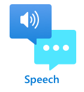
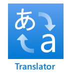

# Support multiple languages

Add a sketchnote if possible/appropriate

This video gives an overview of the Azure speech services, covering speech to text and text to speech from earlier lessons, as well as translating speech, a topic covered in this lesson:

## Pre-lecture quiz

[Pre-lecture quiz](https://brave-island-0b7c7f50f.azurestaticapps.net/quiz/47)

## Introduction

In the last 3 lessons you learned about converting speech to text, language understanding, and converting text to speech, all powered by AI. One other area of human communication that AI can help with is language translation - converting from one language to another, such as from English to French.

In this lesson you will learn about using AI to translate speech and text, allowing your smart timer to interact with users in multiple languages.

In this lesson we'll cover:

* [Translate speech and text using AI](#translate-speech-and-text-using-ai)
* [Support multiple languages in applications with translations](#support-multiple-languages-in-applications-with-translations)

## Translate speech and text using AI

## Support multiple languages in applications with translations

In an ideal world, your whole application should understand as many different languages as possible, from listening for speech, to language understanding, to responding with speech. This is a lot of work, so translation services can speed up the time to delivery of your application.

***A smart timer architecture translating Japanese to English, processing in English then translating back to Japanese. Microcontroller by Template / recording by Aybige Speaker / Speaker by Gregor Cresnar - all from the [Noun Project](https://thenounproject.com)***

For example, imagine you build a smart timer that uses English end-to-end, understanding spoken English and converting that to text, running the language understanding in English, building up responses in English and replying with English speech. If you wanted to add support for Japanese, you could start with translating spoken Japanese to English text, then keep the core of the application the same, then translate the response text to Japanese before speaking the response. This would allow you to quickly add Japanese support, and you can expand to providing full end-to-end Japanese support later.

> 💁 The downside to relying on machine translation is that different languages and cultures have different ways of saying the same things, so the translation may not match the expression you are expecting.

Machine translations also open up possibilities for apps and devices that can translate user-created content as it is created. Science fiction regularly features 'universal translators', devices that can translate from alien languages into (typically) American English. These devices are less science fiction, more science fact, if you ignore the alien part. There are already apps and devices that provide real-time translation of speech and written text, using combinations of speech and translation services.

One example is the [Microsoft Translator](https://www.microsoft.com/translator/apps/?WT.mc_id=academic-17441-jabenn) mobile phone app, demonstrated in this video:

Imagine having such a device available to you, especially when travelling or interacting with folks whose language you don't know. Having automatic translation devices in airports or hospitals would provide much needed accessibility improvements.

## Translation services

There are a number of AI services that can be used from your applications to translate speech and text.

### Cognitive services Speech service

The speech service you've been using over the past few lessons has translation capabilities for speech recognition. When you recognize speech, you can request not only the text of the speech in the same language, but also in other languages.

> 💁 This is only available from the speech SDK, the REST API doesn't have translations built in.

### Cognitive services Translator service

The Translator service is a dedicated translation service that can translate text from one language, to one or more target languages. As well as translating, it supports a wide range of extra features including masking profanity. It also allows you to provide a specific translation for a particular word or sentence, to work with terms you don't want translated, or have a specific well-known translation.

For example, when translating the sentence "I have a Raspberry Pi", referring to the single-board computer, into another language such as French, you would want to keep the name "Raspberry Pi" as is, and not translate it, giving "J’ai un Raspberry Pi" instead of "J’ai une pi aux framboises".

## Translate text using an AI service

### Task - translate text using an AI service

Work through the relevant guide to convert translate text on your IoT device:

* [Arduino - Wio Terminal](wio-terminal-translate-speech.md)
* [Single-board computer - Raspberry Pi](pi-translate-speech.md)
* [Single-board computer - Virtual device](virtual-device-translate-speech.md)

---

## 🚀 Challenge

## Post-lecture quiz

[Post-lecture quiz](https://brave-island-0b7c7f50f.azurestaticapps.net/quiz/48)

## Review & Self Study

## Assignment

[Build a universal translator](assignment.md)
