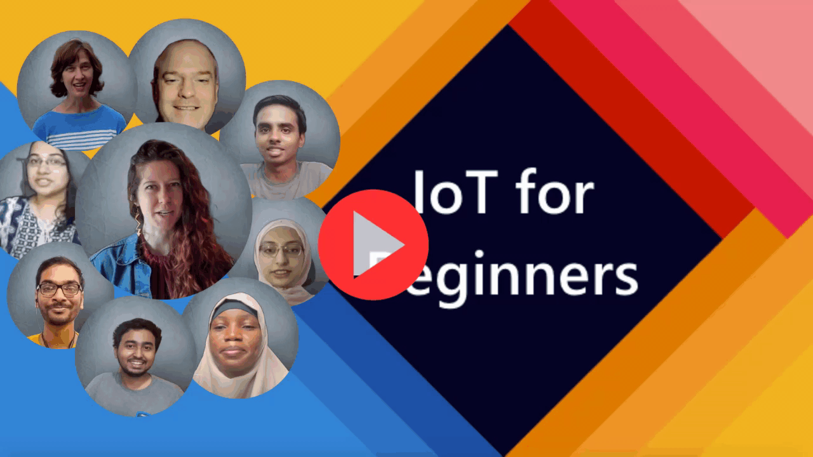

[](https://github.com/microsoft/IoT-For-Beginners/blob/master/LICENSE)
[](https://GitHub.com/microsoft/IoT-For-Beginners/graphs/contributors/)
[](https://GitHub.com/microsoft/IoT-For-Beginners/issues/)
[](https://GitHub.com/microsoft/IoT-For-Beginners/pulls/)
[](http://makeapullrequest.com)

[](https://GitHub.com/microsoft/IoT-For-Beginners/watchers/)
[](https://GitHub.com/microsoft/IoT-For-Beginners/network/)
[](https://GitHub.com/microsoft/IoT-For-Beginners/stargazers/)

[](../../translations/README.bn.md)
[](../../translations/README.zh-cn.md)
[](../README.md)
[](../../translations/README.tr.md)
[](../../translations/README.fr.md)

# IoT for Beginners - A Curriculum

我々、Microsoft社のクラウドアドボケイトチーイトチームはIoTの基礎に関する12週間にわたる合計24のレッスンをご提供できることを心より嬉しく思います。 それぞれのレッスンには問題、解説、IoTのソリューションの紹介、課題などが用意されており、実践的な学習を通して効率的にIoTスキルの取得をすることができます。

このプロジェクトでは、農業、物流、製造業、小売、消費者などIoTが用いられる主要な業界全てを取り上げます。


> Sketchnote by [Nitya Narasimhan](https://github.com/nitya). Click the image for a larger version.


**著者である [Jen Fox](https://github.com/jenfoxbot), [Jen Looper](https://github.com/jlooper), [Jim Bennett](https://github.com/jimbobbennett), そしてアーティストである [Nitya Narasimhan](https://github.com/nitya)に心より感謝します。**

**そしてプロジェクトに協力してくれた[Microsoft Learn Student Ambassadors](https://studentambassadors.microsoft.com?WT.mc_id=academic-17441-jabenn)のメンバーにも感謝の言葉を送ります。( [Aditya Garg](https://github.com/AdityaGarg00), [Anurag Sharma](https://github.com/Anurag-0-1-A), [Arpita Das](https://github.com/Arpiiitaaa), [Aryan Jain](https://www.linkedin.com/in/aryan-jain-47a4a1145/), [Bhavesh Suneja](https://github.com/EliteWarrior315), [Faith Hunja](https://faithhunja.github.io/), [Lateefah Bello](https://www.linkedin.com/in/lateefah-bello/), [Manvi Jha](https://github.com/Severus-Matthew), [Mireille Tan](https://www.linkedin.com/in/mireille-tan-a4834819a/), [Mohammad Iftekher (Iftu) Ebne Jalal](https://github.com/Iftu119), [Mohammad Zulfikar](https://github.com/mohzulfikar), [Priyanshu Srivastav](https://www.linkedin.com/in/priyanshu-srivastav-b067241ba), [Thanmai Gowducheruvu](https://github.com/innovation-platform), [Zina Kamel](https://www.linkedin.com/in/zina-kamel/))**

Meet the team!

[](https://youtu.be/-wippUJRi5k)

**Gif by** [Mohit Jaisal](https://linkedin.com/in/mohitjaisal)

> 🎥 上記の画像をクリックするとビデオが見れます。

> **教師の方々へ** :  [こちら](../../for-teachers.md)を参考にして講義をするめることをお勧めします。もしご自身で新しいレッスンを追加されたい場合は [こちら](../../lesson-template/README.md)のテンプレートをご利用ください。

> **学習者の皆様へ** : こちらのカリキュラムを使うために、フォークを作成しご自身の環境でレッスンを進めてください。また、各レッスンのソリューションは/solutionフォルダから確認可能ですが、コードをコピー＆ペーストするのではなくご自身で手を動かして実装することをお勧めします。学習をさらに進めるために友達と勉強会を開くのもいいかもしれません。そのほか学習に関する推奨事項は[Microsoft Learn](https://docs.microsoft.com/users/jimbobbennett/collections/ke2ehd351jopwr?WT.mc_id=academic-17441-jabenn)を参考にしてください。


コースで用いられる動画の概要については以下の動画をご覧ください。

[](https://youtube.com/watch?v=bccEMm8gRuc "Promo video")

> 🎥 上記の画像をクリックするとビデオが見れます。

## 勉強方法　

このプロジェクトではプロジェクトベースの学習方法を実現するための2つのルールを採用しました。1つ目は各シリーズの終わりに植物の水やり機や自動車追跡、食べ物を追跡するスマートファクトリーの設定、音声で操作できるキッチンタイマーなどを実践的に学習者が実装できるように各レッスンをデザインしました。これにより、IoTの基礎、組み込み向けのコードの書き方、クラウドとの連携方法Edge AIなどを包括的に学ぶことができ、より実践に近い学習を行うことができます。

2つ目に、それぞれのレッスンの前後に簡単な問題(quiz)を設けることで学習した内容がより定着するよにしています。また、このプロジェクトは全部で12週間と膨大なため、学びたい分野のみを選択して学習できるように設計されています。

それぞれのプロジェクトで用いられるハードウェアは誰もが利用できるように世界中で広く利用されているものを採用し、特定の分野における背景や課題を説明するようにしています。ある特定の業界、分野における背景を知ることは開発者として成功する上でとても重要です。背景を知ることで、実際の業務で問われるような課題や必要な知識、IoTソリューションの実装についてイメージしやすく理、そのソリューションの”なぜ”を知ることでよりユーザ視点に立ったソリューションを提供できます。

## ハードウェア

柔軟に自分に合った選択ができるように、IoTハードウェアに関して2つの選択肢を用意しました。それに加えてデバイスを購入したくない方や何らかの事情でハードウェアが購入できない方のために"仮想ハードウェア"を提供しています。 少佐に関しては[hardware page](../../hardware.md)の'shopping list'から確認できます。

> 💁 意見などあればぜひIssueを用いて我々に伝えてください。Contributionするためには[Code of Conduct](../../CODE_OF_CONDUCT.md), [Contributing](../../CONTRIBUTING.md), [Translation](../../TRANSLATIONS.md)に目を通しておいてください。

## それぞれのレッスンの内容

- スケッチノート
- ビデオ(任意)
- レッスン前に行う問題 (Quiz)
- レッスン
- わかりやすいstep-by-stepな説明
- 知識確認
- 任意課題
- 追加資料
- 課題
- レッスンの最後に行う問題（Quiz)

> **問題に関して**: 全ての問題は[このアプリ](https://brave-island-0b7c7f50f.azurestaticapps.net)で利用可能です。問題はそれぞれのレッスン内でリンクが貼られています。もしローカルでアプリを起動したい場合は`quiz-app`フォルダーを参照してください。

## レッスン

|    |                Project Name                |              Concepts Taught               | Learning Objectives                                                                                                    |                                                        Linked Lesson                                                         |
|:--:|:------------------------------------------:|:------------------------------------------:|------------------------------------------------------------------------------------------------------------------------|:----------------------------------------------------------------------------------------------------------------------------:|
| 01 | [Getting started](../../1-getting-started) |                 IoTの基本                  | IoTの基礎知識、IoTソリューションで用いられている基本的な技術について学習し、最初のIoTデバイスの設定を行います。        |                    [Introduction to IoT](../../1-getting-started/lessons/1-introduction-to-iot/README.md)                    |
| 02 | [Getting started](../../1-getting-started) |                IoTの世界へ                 | IoTシステムの構成、マイクロコントローラ、シングルボードコンピュータについて学びます。                                  |                      [A deeper dive into IoT](../../1-getting-started/lessons/2-deeper-dive/README.md)                       |
| 03 | [Getting started](../../1-getting-started) |    センサーとアクチュエータを用いた実践    | センサーを用いてデータを集め、アクチュエータを用いてFeedbackを送信する方法についてナイトライトの実装を通して学びます。 | [Interact with the physical world with sensors and actuators](../../1-getting-started/lessons/3-sensors-and-actuators/README.md) |
| 04 | [Getting started](../../1-getting-started) |      デバイスのインターネットへの接続      | ナイトライトとMQTTブローカーを用いてIoTのインターネットへの接続方法とメッセージの送受信方法について学びます。          |               [Connect your device to the Internet](../../1-getting-started/lessons/4-connect-internet/README.md)                |
| 05 |            [Farm](../../2-farm)            |               植物の成長予測               | IoTデバイスで取得した温度データを用いて植物の成長を予測する方法について学びます。                                      |                        [Predict plant growth](../../2-farm/lessons/1-predict-plant-growth/README.md)                         |
| 06 |            [Farm](../../2-farm)            |                土の水分計測                | 土の水分の計測方法とセンサーの調整方法を学びます。                                                                     |                        [Detect soil moisture](../../2-farm/lessons/2-detect-soil-moisture/README.md)                         |
| 07 |            [Farm](../../2-farm)            |                自動水やり機                | MQTTと中継機を用いて水やりを自動化する方法を学びます。                                                                 |                    [Automated plant watering](../../2-farm/lessons/3-automated-plant-watering/README.md)                     |
| 08 |            [Farm](../../2-farm)            |              クラウドへの移行              | クラウドとクラウドのIoTソリューション、MQTTブローカーの代わりにクラウドを用いる方法について学びます。                  |             [Migrate your plant to the cloud](../../2-farm/lessons/4-migrate-your-plant-to-the-cloud/README.md)              |
| 09 |            [Farm](../../2-farm)            |  水やり機のアプケーションをクラウドへ移行  | IoTメッセージに対応するアプリケーションのクラウド上での実装方法について学びます。                                      |       [Migrate your application logic to the cloud](../../2-farm/lessons/5-migrate-application-to-the-cloud/README.md)       |
| 10 |            [Farm](../../2-farm)            |           水やり機のセキュリティ           | IoTのセキュリティ、キーと証明書を用いて水やり機をセキュアに保つ方法を学びます。                                        |                      [Keep your plant secure](../../2-farm/lessons/6-keep-your-plant-secure/README.md)                       |
| 11 |       [Transport](../../3-transport)       |                  位置追跡                  | IoTデバイスでGPS位置情報を用いた追跡について学びます。                                                                 |                         [Location tracking](../../3-transport/lessons/1-location-tracking/README.md)                         |
| 12 |       [Transport](../../3-transport)       |              位置データの保存              | 分析や可視化のためにIoTデータを保存する方法を学びます。                                                                |                       [Store location data](../../3-transport/lessons/2-store-location-data/README.md)                       |
| 13 |       [Transport](../../3-transport)       |             位置データの可視化             | 位置データをMap上で可視化し、Mapがどのように3次元データを2次元データとして表現しているのかについて学びます。           |                   [Visualize location data](../../3-transport/lessons/3-visualize-location-data/README.md)                   |
| 14 |       [Transport](../../3-transport)       |                ジオフェンス                | ジオフェンスとジオフェンスを用いてサプライチェーンにある自転車が近くにきたらアラートを鳴らす方法を学びます。           |                                 [Geofences](../../3-transport/lessons/4-geofences/README.md)                                 |
| 15 |   [Manufacturing](../../4-manufacturing)   |      フルーツの品質を識別するAIの学習      | フルーツの品質を識別する識別器をクラウド上で学習する方法を学びます。                                                   |               [Train a fruit quality detector](../../4-manufacturing/lessons/1-train-fruit-detector/README.md)               |
| 16 |   [Manufacturing](../../4-manufacturing)   |  IoTデバイスからフルーツの品質を確認する   | フルーツの品質を識別するAIをIoTデバイスから利用する方法を学びます。                                                    |         [Check fruit quality from an IoT device](../../4-manufacturing/lessons/2-check-fruit-from-device/README.md)          |
| 17 |   [Manufacturing](../../4-manufacturing)   |            識別器をEdgeで動かす            | Edgeデバイス上で識別器を動かす方法を学びます。Le                                                                       |           [Run your fruit detector on the edge](../../4-manufacturing/lessons/3-run-fruit-detector-edge/README.md)           |
| 18 |   [Manufacturing](../../4-manufacturing)   | センサーでフルーツの品質識別をトリガーする | センサーを用いてフルーツ品質識別をトリガーする方法を学びます                                                           |      [Trigger fruit quality detection from a sensor](../../4-manufacturing/lessons/4-trigger-fruit-detector/README.md)       |
| 19 |          [Retail](../../5-retail)          |              在庫管理AIの学習              | 物体認識を用いて店舗の在庫を識別する方法を学びます。                                                                   |                      [Train a stock detector](../../5-retail/lessons/1-train-stock-detector/README.md)                       |
| 20 |          [Retail](../../5-retail)          |       IoTデバイスから在庫を確認する        | 物体認識モデルを用いてIoTデバイスから在庫を確認する豊富を学びます。                                                    |                   [Check stock from an IoT device](../../5-retail/lessons/2-check-stock-device/README.md)                    |
| 21 |        [Consumer](../../6-consumer)        |        IoTデバイスを用いた音声認識         | スマートタイマーを実装するためにIoTデバイスから音声認識を行う方法について学びます。                                    |                [Recognize speech with an IoT device](../../6-consumer/lessons/1-speech-recognition/README.md)                |
| 22 |        [Consumer](../../6-consumer)        |             発話内容を理解する             | IoTデバイスで取得した発話内容を理解する方法を学びます。                                                                |                      [Understand language](../../6-consumer/lessons/2-language-understanding/README.md)                      |
| 23 |        [Consumer](../../6-consumer)        |           タイマーのセットと通知           | IoTデバイスでタイマーをセットし、タイマーの開始と終わりに音声で通知する方法を学びます。L                               |               [Set a timer and provide spoken feedback](../../6-consumer/lessons/3-spoken-feedback/README.md)                |
| 24 |        [Consumer](../../6-consumer)        |             複数言語のサポート             | 複数の言語で音声認識、通知する方法を学びます。                                                                         |                 [Support multiple languages](../../6-consumer/lessons/4-multiple-language-support/README.md)                 | |

## オフラインアクセス


[Docsify](https://docsify.js.org/#/)を使えばオフラインでこのドキュメントを利用できます。フォークを作成して、[Docsifyをインストール](https://docsify.js.org/#/quickstart)してください。 インストールが完了したらプロジェクトのルートディレクトリで`docsify serve`を実行し、ブラウザで`localhost:3000`を開いてください。

### PDF

必要であればPDFを作成することもできます。 [npmをインストール](https://docs.npmjs.com/downloading-and-installing-node-js-and-npm)し、プロジェクトのルートディレクトリから以下のコマンドを実行してください。

```sh
npm i
npm run convert
```

### スライド

[slides](../../slides)フォルダーからレッスンのスライドにアクセスできます。

## あなたの助けが必要です！

翻訳に協力していただける方は [translation guidelines](../../TRANSLATIONS.md) と [Translation issue](https://github.com/microsoft/IoT-For-Beginners/issues?q=is%3Aissue+is%3Aopen+label%3Atranslation)を確認してください。 もしまだ翻訳されていない言語の翻訳をしたい場合は、新しいIssueを作ってください。

## そのほかのカリキュラム

私たちはIoT以外にも以下のカリキュラムも提供しています。

- [Web Dev for Beginners](https://aka.ms/webdev-beginners)
- [ML for Beginners](https://aka.ms/ml-beginners)
- [Data Science for Beginners](https://aka.ms/datascience-beginners)

## 画像著作権

カリキュラムで必要な画像の著作権については[Attributions](../../attributions.md)を参照してください。

## 日本語翻訳について

日本語の翻訳に関してFeedbackがあればこちらの[Issue](https://github.com/microsoft/IoT-For-Beginners/issues/195)でコメントする、もしくは新たなIssueを作成しTranslatorにメンションしてください。